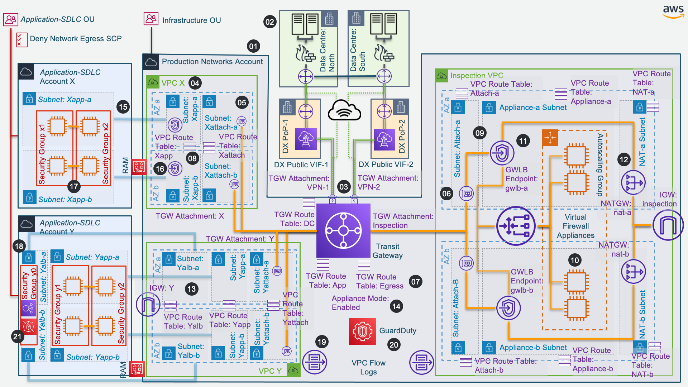

# *NZISM Implementation Guide for AWS*

*Contents*
> * [NZISM Control Objective Index](#nzism-control-objective-index)
>   * [19. Gateway security](#nzism-19)
>   * [22. Enterprise systems security](#nzism-22)
> * Architecture Pattern Catalogue for NZISM
>   * [Gateway Security Using Firewall Appliances](#apc-gsfa)
> * AWS Well-Architected Recommendations
>   * [Security](#aws-security-recommendations)
>   * [Reliability](#aws-reliability-recommendations)
> * [NZISM Conformance Pack Control Index](#nzism-conformance-pack-control-index)
> * [AWS Managed Config Rule Catalogue](#aws-managed-config-rule-catalogue)
> * [References](#references)


---
# *Introduction*

AWS and its NZ public sector customers share control over the IT environment. Therefore, security is a [shared responsibility](#dfn-srm). When it comes to managing security and compliance in the AWS Cloud, each party has distinct responsibilities. A customer’s responsibility depends on which services they are using. However, in general, customers are responsible for building their IT environment in a manner that aligns with their specific security and compliance requirements, as well as those of the NZISM.

Firstly, this guide aims to clarify the respective responsibilities of AWS, and the agency, for each of the NZISM control objectives.

Secondly, this guide aims to cross-reference AWS best practices for implementing the NZISM controls that fall within the agency's area of responsibility.

Finally, this guide complements the AWS NZISM Conformance Pack by describing the continuous compliance checks performed by the conformance pack, how they relate to NZISM controls, and providing advice on remediating non-compliant resources identifies by the conformance pack.

The main body of this document has adopted the structure and indexing of the [NZISM Version 3.4 (December 2020)](#nzism) control objectives for the convenience of agencies working through Certification and Accreditation processes, and auditors working through NZISM Conformance Pack findings.


---
# *Definitions and Terminology*

## AWS Definitions and Terminology

### <a id='dfn-srm'>Shared Responsibility Model</a>
AWS refers to the differentiation of responsibilities between customer and AWS as the [Shared Responsibility Model](#aws-srm).

This customer/AWS shared responsibility model also extends to IT controls. Just as the responsibility to operate the IT environment is shared between AWS and its customers, so is the management, operation and verification of IT controls shared. AWS can help relieve customers of the burden of operating controls by managing those controls associated with the physical infrastructure deployed in the AWS environment that may previously have been managed by the customer. Customers can then use the AWS control and compliance documentation available to them to perform their control evaluation and verification procedures as required.


> *AWS Shared Responsibility Model*
> Source: <https://docs.aws.amazon.com/wellarchitected/latest/security-pillar/shared-responsibility.html>

 Below are examples of controls that are managed by AWS, NZ public sector agencies as customers of AWS, and/or both.

#### Inherited Controls
> Controls which an agency fully inherits from AWS, such as Physical and Environmental controls.

#### Shared Controls
> Controls which apply to both the infrastructure layer and agency layers, but in completely separate contexts or perspectives. In a shared control, AWS provides the requirements for the infrastructure and the agency must provide their own control implementation within their use of AWS services. Examples include:
> * Patch Management: AWS is responsible for patching and fixing flaws within the infrastructure, but agencies are responsible for patching their guest OS and applications.
> * Configuration Management: AWS maintains the configuration of its infrastructure devices, but agencies are responsible for configuring their own guest operating systems, databases, and applications.
> * Awareness & Training: AWS trains AWS employees, but agencies must train their own employees.

#### Agency Specific
> Controls which are solely the responsibility of the agency based on the application they are deploying within AWS services. An example is Zone Security, which may require a customer to route or zone data within specific security environments.

The [AWS Risk and Compliance Whitepaper](#wp-risk-and-compliance) contains more examples and details.


### <a id='dfn-gi'>AWS Global Infrastructure</a>
The AWS Global Infrastructure includes:
* [Regions and Availability Zones](#aws-regions)
* [Local Zones](#aws-localzones)
* [Wavelength Zones](#aws-wavezones)
* [Edge Locations](#aws-edgelocs)
* [Direct Connect Locations](#aws-dxlocs)


### <a id='dfn-op'>Agency On-Premises Infrastructure</a>
This document uses the term *on-premises* to describe utility compute services, storage, networks, and back-up services deployed into:
* data centres that you own or lease,
* data centres operated by an [NZ IaaS](#nziaas) provider,
* your offices and service delivery locations.


### <a id='dfn-opd'>AWS On-Premises Devices</a>
AWS can supply you with a variety of devices designed for [on-premises](#dfn-op) installation. The catalogue of *AWS On-Premises Devices* includes:
* [Outposts](#faq-outposts) 
* [Snow Family](#faq-snow)


### <a id='dfn-env'>Agency AWS Environment</a>
This document makes routine reference to *your AWS environment*. As a customer of AWS, your environment is comprised of:
* Your data content,
* Your applications,
* Backups of your data content and applications,
* Your [AWS Accounts](#ug-accounts),
* Your AWS login credentials and access keys,
* Your end users,
* Your implementation of security controls applied to the use of AWS services; that is, the customer side of the <a id='dfn-srm'>Shared Responsibility Model</a>,
* The physical facilities your provide for housing [AWS On-Premises Devices](#dfn-opd)

The [AWS Customer Agreement](#aws-customer-agreement) formally describes the commitments that AWS makes in respect of your environment, as well as your responsibilities.


### <a id='dfn-ia'>Independent Assessments of AWS Security Controls</a>
Independent third-party assessments of security controls implemented by AWS under the [shared responsibility model](#dfn-srm) are available from:
* The Government Chief Digital Officer: [GCDO Certification](#gcdo-security-documents-for-aws)
* The Australian Information Security Registered Assessors Program: [IRAP PROTECTED Certification](#irap-security-documents-for-aws)
* The Cloud Security Alliance: [CSA Security Documents for AWS](#csa-security-documents-for-aws)
* International Compliance Programmes: [International Compliance](#international-security-documents-for-aws)


### <a id='dfn-ms'>AWS Managed Services</a>
When an agency chooses a managed service, AWS assumes responsibility for managing the operating system, including updates and security patches. Examples of managed services include:
* [Amazon Relational Database Service (RDS)](#faq-rds)
* [Amazon Elasticsearch](#faq-elasticsearch)
* [AWS Lambda](#faq-lambda)
* [Amazon Elastic Container Service (ECS)](#faq-ecs)


### <a id='dfn-ec2'>Amazon EC2</a>
The [Amazon EC2](#faq-ec2) compute service is categorised as Infrastructure as a Service (IaaS) and, as such, requires the agency to perform all of the necessary security configuration and management tasks. Agencies that deploy an Amazon EC2 instance are responsible for:
* management of the guest operating system, including updates and security patches,
* any application software or utilities installed by the agency on the instances, and
* the configuration of the AWS-provided firewall (called a security group) on each instance.

### <a id='dfn-outposts'>AWS Outposts<a/>
[AWS Outposts](#faq-outposts) is a fully managed service that extends AWS infrastructure, services, APIs, and tools to agency premises. By providing local access to AWS managed infrastructure, AWS Outposts enables agencies to build and run applications on premises using the same programming interfaces as in [AWS Regions](#aws-regions), while using local compute and storage resources for lower latency and local data processing needs.

An Outpost is a pool of AWS compute and storage capacity deployed at an agency site. AWS operates, monitors, and manages this capacity as part of an AWS Region. You can create subnets on your Outpost and specify them when you create AWS resources such as EC2 instances, EBS volumes, ECS clusters, and RDS instances. Instances in Outpost subnets communicate with other instances in the AWS Region using private IP addresses, all within the same VPC. 


## General Definitions and Terminology


## <a id='dfn-availability'>Availability</a>
Availability is the percentage of time that a workload is available for use. *Available for use* means that it performs its agreed function successfully when required.

This percentage is calculated over a period of time, such as a month, year, or trailing three years. Applying the strictest possible interpretation, availability is reduced any time that the application isn’t operating normally, including both scheduled and unscheduled interruptions. We define availability as follows:
> `Availability = Available for Use Time ÷ Total Time`

### <a id='dfn-dr'>Disaster Recovery</a>
Disaster Recovery focuses on one-time recovery objectives in response natural disasters, large-scale technical failures, or human threats such as attack or error. This is different than availability which measures mean resiliency over a period of time in response to component failures, load spikes, or software bugs.

### <a id='dfn-rto'>Recovery Time Objective (RTO)</a>
Quantified by each agency, RTO is the maximum acceptable delay between the interruption of service and restoration of service. This determines what is considered an acceptable time window when service is unavailable.

RTO is similar to MTTR (Mean Time to Recovery) in that both measure the time between the start of an outage and workload recovery. However MTTR is a mean value taken over several availability impacting events over a period of time, while RTO is a target, or maximum value allowed, for a single availability impacting event. 


### <a id='dfn-rpo'>Recovery Point Objective (RPO)</a>
Quantified by each agency, RPO is the maximum acceptable amount of time since the last data recovery point. This determines what is considered an acceptable loss of data between the last recovery point and the interruption of service. 


---
# *NZISM Control Objective Index*


# 1. About information security

#### Responsibilities
This section is for the guidance of agencies. There are no applicable AWS responsibilities.


# 2. Information Security within Government

#### Responsibilities
This section is for the guidance of agencies. There are no applicable AWS responsibilities.


# 3. Information security governance - roles and responsibilities

#### Responsibilities
All controls under Section 3 are the responsibility of agencies. There are no applicable AWS responsibilities.

#### Agency Guidance
You should ensure that you have a good understanding of [Security Governance](#security-governance) in the context of the [AWS Shared Responsibility Model](#dfn-srm).


# 4. System Certification and Accreditation

#### Responsibilities
This section is for the guidance of agencies. There are no applicable AWS responsibilities.


# 5. Information security documentation

#### Responsibilities
This section is for the guidance of agencies. There are no applicable AWS responsibilities.


# 6. Information security monitoring

#### AWS Responsibilities
The responsibilities that AWS assumes for information security monitoring within [AWS Global Infrastructure](#dfn-gi) and [AWS On-Premises Devices](#dfn-opd) are detailed in the various control objectives under Section 6. 

#### Agency Responsibilities
You are responsible for information security monitoring of activities related to the physical environment you provide for [AWS On-Premises Devices](#dfn-opd). These activities include maintenance, change management, business continuity and disaster recovery. Additional agency responsibilities are detailed under Section 6.


## 6.1. Information Security Reviews

#### AWS Responsibilities
AWS is responsible for ensuring that information security reviews maintain the security of:
* [AWS Global Infrastructure](#dfn-gi), and
* [AWS On-Premises Devices](#dfn-opd) - excluding physical security reviews
 
You have self-service access to [independent assessments](#dfn-ia) of the AWS information security review controls.

#### Agency Responsibilities
You are responsible for ensuring that information security reviews maintain the security of the applications and data within [your AWS environments](#dfn-env).


## 6.2. Vulnerability Analysis

#### AWS Responsibilities
AWS is responsible for ensuring that exploitable information system weaknesses within [AWS Global Infrastructure](#dfn-gi) and [AWS On-Premises Devices](#dfn-opd) can be identified by vulnerability analyses and that they inform assessments and controls selection. You have self-service access to [independent assessments](#dfn-ia) of the AWS information security monitoring controls.

#### Agency Responsibilities
Your responsibility for vulnerability analysis will be determined by the AWS services selected.

[Amazon EC2](#dfn-ec2)
> You are responsible for ensuring that exploitable weaknesses within the guest operating system can be identified by vulnerability analyses, and that they inform assessments and controls selection.
[AWS Managed Services](#dfn-ms)
> You are responsible for vulnerability analysis within the use of the selected managed service.

#### Agency Guidance
Firstly, reduce your vulnerability analysis workload by [implementing AWS Managed Services](#implement-managed-services) where possible.

When deploying to Amazon EC2, you are responsible for performing [patch management](#perform-patch-management) and [vulnerability management](#perform-vulnerability-management).

You can use [Patch Manager](#ug-patch-manager) to automate the process of patching EC2 instances with security updates. You should also [reduce your attack surface](#reduce-attack-surface) by hardening operating systems and minimising the components, libraries, and externally consumable services in use.

In Amazon EC2, you can create your own [standard operating environments](#standard-operating-environments) using [AMIs](#ug-ec2-ami) which you have patched and hardened.


## 6.3. Change Management

#### AWS Responsibilities
AWS is responsible for ensuring that information security is incorporated into maintenance governance, and change management activities, for:
* [AWS Global Infrastructure](#dfn-gi), and
* [AWS On-Premises Devices](#dfn-opd) - excluding physical security change management

You have self-service access to [independent assessments](#dfn-ia) of the AWS change management controls.

#### Agency Responsibilities
You are responsible for ensuring that information security is incorporated into maintenance governance and change management activities relating to [your AWS environments](#dfn-env).

#### Agency Guidance
Changes to your applications, or their environment, must be anticipated and accommodated to achieve reliable operation. Changes include those *imposed* on your application, as well those you initiate; such as feature deployments and maintenance activities. Changes imposed on your application could be legitimate - such as a public campaign, a civil defence emergency, or a pandemic response - or malicious, such as a [Distributed Denial of Service](#article-ddos) (DDoS) attack. Here are some basic best practices for change management.

#### Monitor the resources your applications consume
> All components of your application should be monitored, including the front-end, business logic, and storage tiers. Define key metrics and how to extract them from logs, if necessary, and set create thresholds for corresponding alarm events. Use [Amazon CloudWatch](#ug-cw) as a foundation. Monitoring enables your application to recognise when low-performance thresholds are crossed or failures occur, so it can recover automatically in response. See the [monitoring workload resources](#monitor-workload-resources) topic for detailed recommendations.

#### Design your application to adapt to changes in demand
> A scalable application provides elasticity to add or remove resources automatically so that they closely match the current demand at any given point in time. This capability is also valuable in mitigating the impact of a malicious (or accidental) volumetric threats. Refer to the [design your workload to adapt to changes in demand](#design-your-workload-to-adapt-to-changes-in-demand) topic for detailed design and testing recommendations.

#### Integrate functional testing as part of your deployment
> As part of your automated deployment process, run functional tests in a pre-production environment. If success criteria are not met, roll back and halt the pipeline.

####  Deploy using immutable infrastructure
> This is a model that mandates that no updates, security patches, or configuration changes happen *in-place* on production systems. When a change is needed, the architecture is built onto new infrastructure and deployed into production. Use a [canary](#canary-deployment) or [blue/green](#blue-green-deployment) deployment when deploying applications in immutable infrastructures.

#### Deploy changes with automation
> Automate deployments and patching to eliminate negative impact. Making changes to production systems is one of the largest risk areas for many agencies. AWS considers deployments a first-class problem to be solved alongside the business problems that the software addresses. Today, this means the use of automation wherever practical in operations, including testing and deploying changes, adding or removing capacity, and migrating data.

Refer to the [change implementation](#implement-change) topic for detailed recommendations.


## 6.4. Business Continuity and Disaster Recovery

#### AWS Responsibilities
AWS is responsible for ensuring that business continuity and disaster recovery processes are established for:
* [AWS Global Infrastructure](#dfn-gi), and
* [AWS On-Premises Devices](#dfn-opd) - excluding physical availability and recovery

You have self-service access to [independent assessments](#dfn-ia) of the AWS business continuity and disaster recovery controls.


#### Agency Responsibilities
You are responsible for ensuring that business continuity and disaster recovery processes are established within [your AWS environments](#dfn-env), and that these processes assist in meeting the agency’s business requirements, minimise any disruption to the availability of information and systems, and assist recoverability.

#### Agency Guidance
Having backups and redundant application components in place is the start of your DR strategy. Set [recovery time objective](#dfn-rto) (RTO) and [recovery point objective](#dfn-rpo) (RPO) based on business needs. Implement a strategy to meet these objectives, considering the locations and function of application resources and data. The probability of disruption and cost of recovery are also key factors that help to inform the business value of providing disaster recovery for an application. Here are some foundational best practices for business continuity and disaster recovery.

#### Define recovery objectives for downtime and data loss
> Ensure the workload has a [RTO](#dfn-rto) and [RPO](#dfn-rpo).

#### Use defined recovery strategies to meet the recovery objectives
> Ensure a disaster recovery (DR) strategy has been defined to meet objectives. Choose a strategy such as: [backup and restore](#war-backup-and-restore), [active/passive pilot light](#war-pilot-light), [active/passive warm standby](#war-warm-standby), or [active/active](#war-active-active). For more details on AWS services you can use for active-active architectures see the AWS Regions section of [Use Fault Isolation to Protect Your Workload](#use-fault-isolation-to-protect-your-workload).

#### Test disaster recovery implementation to validate the implementation
> Regularly test failover to DR to ensure that RTO and RPO are met.

#### Manage configuration drift at the DR site or AWS Region
> Ensure that your infrastructure, data, and configuration are in a state of readiness at the DR site or Region. For example, check that AMIs and service quotas are up to date.

#### Automate recovery
> Use AWS or third-party tools to automate system recovery and route traffic to the DR site or region.

Refer to the [fault isolation](#use-fault-isolation-to-protect-your-workload) [disaster recovery planning](#plan-for-disaster-recovery) topics for detailed recommendations.


# 7. Information Security Incidents

#### AWS Responsibilities
The responsibilities that AWS assumes for information security incident detection, reporting, and management within [AWS Global Infrastructure](#dfn-gi) and [AWS On-Premises Devices](#dfn-opd) are detailed in the various control objectives under Section 7.

#### Agency Responsibilities
You are responsible for information security incident detection, reporting, and management in relation to the physical environment you provide for [AWS On-Premises Devices](#dfn-opd). Additional agency responsibilities are detailed under Section 7.

## 7.1. Detecting Information Security Incidents

#### AWS Responsibilities
AWS is responsible for ensuring that appropriate tools, processes and procedures are implemented to detect information security incidents within:
* [AWS Global Infrastructure](#dfn-gi), and
* [AWS On-Premises Devices](#dfn-opd) - excluding incidents related to physical security

You have self-service access to [independent assessments](#dfn-ia) of the AWS information security incident detection controls.

#### Agency Responsibilities
You are responsible for ensuring that appropriate tools, processes and procedures are implemented to detect information security incidents within [your AWS environments](#dfn-env).


## 7.2. Reporting Information Security Incidents

#### AWS Responsibilities
AWS is responsible for ensuring that the reporting of information security incidents, to all impacted customer agencies, is incorporated as an essential part of incident management within:
* [AWS Global Infrastructure](#dfn-gi), and
* [AWS On-Premises Devices](#dfn-opd) - excluding incidents related to physical security

You have self-service access to [independent assessments](#dfn-ia) of the AWS information security incident reporting controls.


#### Agency Responsibilities
You are responsible for ensuring that the reporting of information security incidents, relating to applications and data within [your AWS environments](#dfn-env), is incorporated as an essential part of incident management.


## 7.3. Managing Information Security Incidents

#### AWS Responsibilities
AWS is responsible for identifying and implementing processes for information security incident identification, management, and analysis within:
* [AWS Global Infrastructure](#dfn-gi), and
* [AWS On-Premises Devices](#dfn-opd) - excluding incidents related to physical security
AWS is also responsible for selecting remedies which will assist in preventing or reducing the impact of future incidents within these areas.

You have self-service access to [independent assessments](#dfn-ia) of the AWS information security incident management controls.


#### Agency Responsibilities
Your are responsible for identifying and implementing processes for information security incident identification, management, and analysis within [your AWS environments](#dfn-env). You are also responsible for selecting remedies which will assist in preventing or reducing the impact of future incidents.


# 8. Physical Security

## 8.1. Facilities

#### AWS Responsibilities
AWS is responsible for the physical security measures that are applied to the facilities comprising [AWS Global Infrastructure](#dfn-gi). You have self-service access to [independent assessments](#dfn-ia) of the physical security measures that AWS applies to its facilities.

#### Agency Responsibilities
You are responsible for the physical security measures applied to the facilities you provide for [AWS On-Premises Devices](#dfn-opd).


## 8.2. Servers And Network Devices

#### AWS Responsibilities
AWS is responsible for ensuring that secured server and communications rooms within the [AWS Global Infrastructure](#dfn-gi) provide appropriate physical security for servers and network devices. You have self-service access to [independent assessments](#dfn-ia) of the physical security measures that AWS applies to its server and communications rooms.

#### Agency Responsibilities
You are responsible for ensuring that the secured server and communications rooms housing [AWS On-Premises Devices](#dfn-opd) (at least those classed as servers or network devices), provide appropriate physical security.


## 8.3. Network Infrastructure

#### AWS Responsibilities
AWS is responsible for ensuring that network infrastructure within the [AWS Global Infrastructure](#dfn-gi) is protected by secure facilities and the use of encryption technologies. You have self-service access to [independent assessments](#dfn-ia) of the secure facilities and encryption technologies that AWS applies to its network infrastructure.

[AWS Outposts](#dfn-outposts)
> As a managed service, AWS Outposts is protected by the AWS global network security procedures that are described in the [AWS Overview of Security Processes](#wp-security) whitepaper.

#### Agency Responsibilities
You are responsible for ensuring that network infrastructure used by [AWS On-Premises Devices](#dfn-opd) is protected by secure facilities and the use of encryption technologies.


## 8.4. IT Equipment

#### AWS Responsibilities
AWS is responsible for ensuring that IT equipment within the [AWS Global Infrastructure](#dfn-gi) is secured outside of normal working hours, or is non-operational, when work areas are unoccupied.

[AWS Outposts](#dfn-outposts)
> * Amazon EBS encryption is an encryption solution for Outposts EBS volumes and snapshots. It uses [AWS Key Management Service](#ug-kms) (AWS KMS) [customer master keys](#ug-kms-cmk) (CMK). With Outposts, [encryption](#ug-ecs-ebs-encryption) is enabled by default.
> * In addition, customer data is wrapped in a NIST-compliant physical security key (Nitro Security Key). Destroying the security key device is equivalent to destroying the data.
> * If hardware maintenance is required, AWS will contact you to confirm a date and time for the AWS installation team to visit your Outpost site. When the AWS installation team arrives on site, they will replace the unhealthy hosts, switches, or rack elements and bring the new capacity online. They will not perform any hardware diagnostics or repairs on site. If they replace a host, they will remove and destroy the NIST-compliant physical security key, effectively shredding any data that might remain on the hardware. This ensures that no data leaves your site. If they replace an Outpost networking device, network configuration information might be present on the device when it is removed from the site. This information might include IP addresses and ASNs used to establish virtual interfaces for configuring the path to your local network or back to the Region.
> * AWS encrypts in-transit data over the [service link](#ug-outposts-connectivity-region) that connects your Outpost to its AWS Region. For more information, see Connectivity through service links.


#### Agency Responsibilities
You are responsible for ensuring that [AWS On-Premises Devices](#dfn-opd) are secured outside of normal working hours, or are non-operational, when work areas are unoccupied.

[AWS Outposts](#dfn-outposts)
> * You are responsible for configuring the Outpost [local gateway](#ug-outposts-connectivity-local) that connects the Outpost to your local infrastructure.
> * You are also responsible for encrypting in-transit data between the Outpost and local application infrastructure.


## 8.5. Tamper Evident Seals

#### AWS Responsibilities
AWS is responsible for ensuring that mechanisms and associated auditing processes identify attempts to bypass the physical security of systems within the [AWS Global Infrastructure](#dfn-gi). You have self-service access to [independent assessments](#dfn-ia) of these mechanisms and audit processes.

#### Agency Responsibilities
You are responsible for ensuring that tamper evident seals and associated auditing processes identify attempts to bypass the physical security of [AWS On-Premises Devices](#dfn-opd).

[AWS Outposts](#dfn-outposts)
> As part of the shared responsibility model, you are responsible for attesting to physical security and access controls around the Outpost device.


# 9. Personnel Security
*Work-In-Progress*

# 10. Infrastructure	
*Work-In-Progress*

# 11. Communications Systems and Devices
*Work-In-Progress*

# 12. Product Security
*Work-In-Progress*

# 13. Media and IT Equipment Management, Decommissioning and Disposal
*Work-In-Progress*

# 14. Software security
*Work-In-Progress*

# 15. Email security
*Work-In-Progress*

# 16. Access Control and Passwords
*Work-In-Progress*

# 17. Cryptography
*Work-In-Progress*

# 18. Network security
*Work-In-Progress*

# <a id='nzism-19'>19. Gateway security</a>

## 19.1. Gateways

#### AWS Responsibilities
AWS is responsible for ensuring that gateways are properly configured to protect its [Global Infrastructure](#dfn-gi), and the information transferred between systems from different security domains.

The responsibilities that AWS assumes for gateway configuration within [AWS On-Premises Devices](#dfn-opd), and information transferred to and from the AWS Global Infrastructure, is described in these documents:

[Outposts](#faq-outposts)
> * [Local connectivity](#ug-outposts-connectivity-local)
> * [Region connectivity](#ug-outposts-connectivity-region)
> * [Site Requirements](#ug-outposts-site-requirements)

[Snow Family](#faq-snow)
> *Not Applicable*

You have self-service access to [independent assessments](#dfn-ia) of the AWS gateway controls.


#### Agency Responsibilities
You are responsible for ensuring that gateways are properly configured to protect [your AWS environment](#dfn-env), and the information transferred between systems from different security domains. Your responsibilities for the various type of gateway are detailed in Section 19.1.

### 19.1.11. Using gateways

### 19.1.11.C.01
#### CID 3549

#### Agency Responsibilities
You must ensure that:
* all your [VPC](#ug-vpc) and [on-premises](#dfn-op) networks are protected from VPC and on-premises networks in other security domains by one or more gateways; and
* all gateways contain mechanisms to filter or limit data flow at the network and content level to only the information necessary for business purposes.

#### Agency Guidance


### 19.1.12. Configuration of gateways

### 19.1.12.C.01.
#### CID 3562

#### Agency Responsibilities
You must ensure that gateways:
* are the only communications paths into and out of internal networks;
* by default, deny all connections into and out of the network;
* allow only explicitly authorised connections;
* are managed via a secure path isolated from all connected networks;
* provide sufficient logging and audit capabilities to detect information security incidents, attempted intrusions or anomalous usage patterns; and
* provide real-time alerts.

You are responsible for implementing all of these controls within [on-premises](#dfn-op) networks. However, the [VPCs](#ug-vpc) within your AWS environment inherit the following controls from AWS:
* By design, communications paths into and out of VPCs are controlled by Gateways (sub-types listed below), [VPC Endpoints](#ug-vpc-endpoints), [PrivateLink](#ug-vpc-privatelink), and [Peering](#ug-vpc-peering). The most commonly used gateway types are:
> * [Internet Gateways](#ug-vpc-igw),
> * [Transit Gateways](#ug-tgw),
> * [Virtual Private Gateways](#ug-vpn-s2s)
* By default, a VPC provides no mechanism for inbound or outbound communications,
* VPCs are configured through AWS-managed API end-points (control plane). All VPC configuration requests must be authenticated and authorized by [AWS Identity and Access Management](#ug-iam).


#### Agency Guidance
You should [control traffic at all layers](#control-traffic-at-all-layers), and then [implement inspection and protection](#implement-inspection-and-protection) at each of these layers. Wherever possible, you should [automate these network protections](#automate-network-protection).

The [VPC Flow Logs](#ug-vpc-flow-logs) feature that enables you to capture information about the IP traffic going to and from network interfaces in your VPC. Flow log data can be published to [Amazon CloudWatch Logs](#ug-cwl) or [Amazon S3](#ug-s3).

[Amazon GuardDuty](#ug-guardduty) analyses multiple data sources, including VPC Flow Logs and DNS logs. It uses threat intelligence feeds, such as lists of malicious IP addresses and domains, and machine learning to identify unexpected and potentially unauthorized and malicious activity within your AWS environment. This can include issues like escalations of privileges, uses of exposed credentials, or communication with malicious IP addresses, or domains.
> For example, GuardDuty can detect compromised EC2 instances serving malware or mining bitcoin. It also monitors AWS account access behavior for signs of compromise, such as unauthorized infrastructure deployments, like instances deployed in a Region that has never been used, or unusual API calls, like a password policy change to reduce password strength. 

GuardDuty informs you of the status of your AWS environment by producing security findings that you can view in the GuardDuty console or through Amazon CloudWatch events. You can use [CloudWatch Events](#ug-cwe) with GuardDuty to set up automated finding alerts by sending GuardDuty finding events to a messaging hub to help increase the visibility of GuardDuty findings.


# 20. Data management
*Work-In-Progress*

# 21. Working Off-Site
*Work-In-Progress*

# <a id='nzism-22'>22. Enterprise systems security</a>

## 22.1. Cloud Computing

#### AWS Responsibilities
AWS is responsible for ensuring that agencies have access to current risk assessment information for the AWS platform. Sources of risk assessment information include:
* AWS vendor responses provided in the [GCDO Cloud Risk Assessment Tool](#gcdo105),
* [AWS Risk and Compliance Whitepaper](#wp-risk-and-compliance),
* [AWS Customer Agreement](#aws-customer-agreement),
* [AWS Service Terms](#aws-service-terms),
* this document.

#### Agency Responsibilities
You are responsible for ensuring that cloud systems risks within [your AWS environments](#dfn-env) are identified and managed, and that Official Information and agency information systems are protected in accordance with Cabinet Directives, the [PSR](#psr), the [New Zealand Government Security Classification System](#psr-classification), the NZISM and with other government security requirements and guidance.

Eligible NZ government agencies consuming AWS as an affiliate under the [NZ Cloud Framework Agreement](#nzcfa) (NZ CFA) benefit from standard contractual terms negotiated by the Department of Internal Affairs regarding jurisdiction, security, and privacy.

Organisations that are not eligible to become an affiliate of the NZ CFA should refer to the [AWS Customer Agreement](#aws-customer-agreement) for the current terms and conditions governing your access to and use of the AWS Service Offerings; in particular *Section 3. Security and Data Privacy*.


### 22.1.22. Offshore Services

### 22.1.22.C.01
#### CID 4820

#### Agency Guidance
In order to fully understand and consider jurisdictional, sovereignty, and privacy risks, you should review:
* The [AWS NZ Data Privacy](#aws-nz-data-privacy) home page. This page provides detailed guidance on using AWS to store or process content containing personal information, in the context of the [New Zealand Privacy Act 2020](#nz-privacy-act).
* The New Zealand Notifiable Data Breaches (NZNDB) Addenda available online as click-through agreements in [AWS Artifact](#aws-artifact). The NZNDB Addenda address your need for notification if a security event affects your data.
* The [AWS Data Residency Policy Perspectives](#wp-data-residency) whitepaper. This whitepaper discusses topics such as compelled access risk, unauthorised access risk. The information published by NZ Crown Law on the Mutual Assistance in Criminal Matters Act 1992, which allows for requests to be made to New Zealand by prescribed foreign countries (such as Australia, UK and the US), provides an NZ context. For a current and practical perspective on the volume, origin, and characteristics (customer content versus service attributes such as billing information) of law enforcement information requests, refer to the published [information request reports](#aws-information-requests).


### 22.1.22.C.02
#### CID 4821

#### Agency Guidance
As stated on the [AWS NZ Data Privacy](#aws-nz-data-privacy) home page (*Who can access customer content?*):
> Customers maintain ownership and control of their customer content and select which AWS services process, store and host their customer content. AWS does not have visibility into customer content and does not access or use customer content except to provide the AWS services selected by a customer or where required to comply with the law or a binding legal order.
> Customers using AWS services maintain control over their content within the AWS environment. They can:
> * Determine where it will be located, for example the type of storage environment and geographic location of that storage.
> * Control the format of that content, for example plain text, masked, anonymized or encrypted, using either AWS provided encryption or a third-party encryption mechanism of the customer’s choice.
> * Manage other access controls, such as identity access management and security credentials.
> * Control whether to use SSL, Virtual Private Cloud and other network security measures to prevent unauthorized access.
> This allows AWS customers to control the entire life-cycle of their content on AWS and manage their content in accordance with their own specific needs, including content classification, access control, retention and deletion.


The [AWS Data Privacy FAQ](#faq-data-privacy) provides a summary of contractual commitments regarding:
* Access,
* Security,
* Disclosure of customer content, and
* Security assurance

The commitment regarding *Access* is relevant to agency information ownership:
> As a customer, you maintain **full control** of your content that you upload to the AWS services under your AWS account, and responsibility for configuring access to AWS services and resources. We provide an advanced set of access, encryption, and logging features to help you do this effectively (e.g., AWS Identity and Access Management, AWS Organizations and AWS CloudTrail). We provide APIs for you to configure access control permissions for any of the services you develop or deploy in an AWS environment. **We do not access or use your content for any purpose without your agreement.** We never use your content or derive information from it for marketing or advertising purposes.


### 22.1.24. Unauthorised Access

### 22.1.24.C.04
#### CID 4839

#### Agency Responsibilities
You should consider the use of encryption for data in transit and at rest.

#### Agency Guidance
[Protecting your data](#protecting-data-at-rest) at rest reduces the risk of unauthorized access, when encryption and appropriate access controls are implemented. You should take the following actions:
> * [Implement secure key management](#implement-secure-key-management)
> * [Enforce encryption at rest](#enforce-encryption-at-rest)
> * [Audit the use of encryption keys](#audit-the-use-of-encryption-keys)
> * [Use mechanisms to keep people away from data](#use-mechanisms-to-keep-people-away-from-data)
> * [Automate data at rest protection](#automate-data-at-rest-protection)

 By providing the appropriate level of [protection for your data in transit](#protecting-data-in-transit), you protect the confidentiality and integrity of your workload’s data. You should take the following actions:
 > * [Implement secure key and certificate management](#implement-secure-key-and-certificate-management)
 > * [Enforce encryption in transit](#enforce-encryption-in-transit)
 > * [Authenticate network communications](#authenticate-network-communications)
 > * [Automate detection of unintended data access](#automate-detection-of-unintended-data-access)


#### Continuous Compliance Rules
* [s3-bucket-ssl-requests-only](#cr-s3-bucket-ssl-requests-only)


# 23. Supporting Information

#### Responsibilities
This section is for the guidance of agencies. There are no applicable AWS responsibilities.


---
# **Architecture Pattern Catalogue for NZISM**

# <a id='apc-gsfa'>Gateway Security Using Firewall Appliances</a>

## Applicability
You should consider this pattern if you have multiple product teams, each managing their own AWS accounts, and a centralised networking team responsible for controlling access to [on-premises](#dfn-op) and Internet resources. Because this pattern uses virtual firewall appliances from third-party vendors, it leverages your agency's existing skills with those vendor products.


## In Scope
* Routes to on-premises systems for AWS compute resources such as [EC2 instances](#ug-ec2) and [Lambda](#ug-lambda) functions,
* Routes to VPC-based compute and database resources for on-premises systems,
* Routes to [VPC endpoints](#ug-vpc-endpoints) and [PrivateLink](#ug-vpc-privatelink) for on-premises systems,
* Internet ingress routes for [load balancers](#ug-lb) and EC2 instances,
* Internet egress routes for AWS compute resources,
* Layer 7 inspection of traffic between on-premises systems and AWS resources (North-South),
* Layer 7 inspection of Internet egress traffic from AWS resources,


## Options
* Layer 7 inspection of traffic between resources owned by different AWS application account (East-West).
* A pair of Direct Connect [Public Virtual Interfaces](#ug-dx-vif), using diverse Direct Connect Points-of-Presence (PoPs), configured as the preferred routes for the IPsec VPN tunnels. This the [recommended best practice](#article-dx-resiliency) for critical workloads.


## Out of Scope
* Layer 7 inspection of Internet ingress traffic to [load balancers](#ug-lb),
* Layer 7 inspection of Internet ingress traffic to EC2 instances.


## Input Parameters for Pattern
* VPC requirements for each application AWS account, including whether East-West inspection is required, and whether Internet-facing resources such as load balancers are required,
* On-premises customer gateway configurations for [site-to-site VPNs](#ug-vpn-s2s),
* Firewall appliance configurations and rule sets.


## How It Works
This pattern uses a [Transit Gateway](#ug-tgw) to route both VPC and VPN traffic through a highly available, auto-scaling cluster of virtual firewall appliances managed by a [Gateway Load Balancer](#ug-gwlb). The Transit Gateway terminates VPN connections from two (or more) on-premises data centres.

The Transit Gateway is the next-hop router for all *application SDLC VPCs*. An application SDLC VPC provides connectivity for the compute, database, analytics, and storage resources associated with one or more line-of-business applications, at a specific phase of the system development lifecycle. Examples of an application SDLC VPC might include: *Patient Portal UAT*, *Payments Production*, or *Case Management Development*.

The Transit Gateway is also the next-hop router for the Inspection VPC. All these VPCs, and the Transit Gateway itself, are owned by a single *Production Networks Account*.

Application SDLC AWS accounts create and own the compute, database, analytics, and storage resources required by the application. The networking resources required by these application resources - such as subnets and [VPC endpoints](#ug-vpc-endpoints) - are shared with the application SDLC account by the Production Networks Account using [AWS Resource Access Manager](#ug-ram).

This delegation of responsibilities is enforced by a [Service Control Policy (SCP)](#ug-scp) which denies VPC egress configuration permission to application SDLC accounts. To facilitate this, application SDLC accounts are linked to an *Application OU*, while the Production Networks Account is linked to an *Infrastructure OU*.


### Virtual Firewall Appliances
Firewall appliance products can be selected from AWS Marketplace. Examples include:
* [Check Point](#partner-checkpoint-firewall)
* [Cisco](#partner-cisco-firewall)
* [Fortinet](#partner-fortinet-firewall)
* [Trend Micro](#partner-trendmicro-firewall)

### Direct Connect
A public virtual interface (VIF) allows you to access all AWS public services and endpoints using their public IP addresses. When you create a VPN attachment on the Transit Gateway, you get two public IP addresses for VPN termination at the AWS end. These public IPs are reachable over the public VIF. You can create as many VPN connections as you want over a Public VIF. When you create a BGP peering over the public VIF, AWS advertises the entire AWS public IP range to your router.

Transit Gateway supports [Equal-Cost Multi-Path (ECMP)](#wiki-ecmp) on VPN attachments. Each VPN connection has a maximum of 1.25-Gbps throughput, and enabling ECMP allows you to aggregate throughput across VPN connections.

Refer to the [Building a Scalable and Secure Multi-VPC AWS Network Infrastructure](#wp-multi-vpc-networking) for details.

### Gateway Load Balancer
Gateway Load Balancers enable you to deploy, scale, and manage virtual appliances, such as firewalls, intrusion detection and prevention systems, and deep packet inspection systems. It combines a transparent network gateway (that is, a single entry and exit point for all traffic) and distributes traffic while scaling your virtual appliances with the demand.

A Gateway Load Balancer operates at the third layer of the Open Systems Interconnection (OSI) model, the network layer. It listens for all IP packets across all ports and forwards traffic to the target group that's specified in the listener rule. It maintains stickiness of flows to a specific target appliance using 5-tuple (for TCP/UDP flows) or 3-tuple (for non-TCP/UDP flows). The Gateway Load Balancer and its registered virtual appliance instances exchange application traffic using the GENEVE protocol (on port 6081).


## Example
The following figure illustrates a sample environment with two application accounts, `X` and `Y`, each running fleets of EC2 instances. Account `Y` has deployed an Internet-facing [ALB](#ug-alb). The environment includes two data centres, `North` and `South`, each connecting to a Direct Connect Point-of-Presence, `DX PoP-1` and `DX PoP-2`, respectively. Alternative ISP routes are provisioned.


**(01)**: The Production Networks Account owns all production VPCs. In this environment, there are three VPCs: `X`, `Y` and `Inspection`.

**(02)**: There are two on-premises data centres, `North` and `South`, each equipped with a hardware router and VPN device. The `North` VPN device initiates two IPsec tunnels. Each tunnel terminates on a public IP of the `VPN-1` Transit Gateway attachment. The `South` device initiates the `VPN-2` tunnels.

**(03)**: The IPsec tunnel public IPs provisioned by the Transit Gateway are advertised to both data centres over Direct Connect Public VIFs, and ISPs, via a BGP peering.

#### Networks
For illustration purposes, this example uses the following networks and CIDR ranges.
| Network             | CIDR
|---------------------|----------------
| VPC `X`             | 10.0.0.0/25
| VPC `Y`             | 10.0.0.128/25
| VPC `Inspection`    | 10.10.10.0/24
| Data Centre `North` | 172.16.0.0/17
| Data Centre `South` | 172.16.128.0/17

**(04)**: VPC `X` spans two availability zones; `AZ a` and `AZ b`. Availability zone `AZ a` contains two subnets; `Xapp-a` and `Xattach-a`. Availability zone `AZ b` also contains two corresponding subnets. 

**(05)**: Subnets `Xattach-a` and `Xattach-b` are reserved for Transit Gateway attachment. When VPC `X` is attached to the Transit Gateway (TGW), the TGW provisions two network interfaces; one in each subnet. VPC `Y` is attached to the TGW in the same way.

**(06)**: The `Inspection` VPC is attached to the Transit Gateway using dedicated subnets `Attach-a` and `Attach-b`.

#### TGW Attachments
The following table shows all the Transit Gateway attachments.
| Name          | Type | Attachment Points 
|---------------|------|-------------------------------------
| `X`           | VPC  | Subnets: `Xattach-a`, `Xattach-b`
| `Y`           | VPC  | Subnets: `Yattach-a`, `Yattach-b`
| `Inspection`  | VPC  | Subnets: `Attach-a`, `Attach-b`
| `VPN-1`       | VPN  | Customer Gateway for Data Centre `North`
| `VPN-2`       | VPN  | Customer Gateway for Data Centre `South`

**(07)**: The Transit Gateway contains three route tables; `Egress`, `DC`, and `App`. The `Egress` route table receives IP packets from the `Inspection` VPC, and forwards them to VPCs `X` and `Y`, or on-premises prefixes automated propagated by BGP sessions over `VPN-1` or `VPN-2`. The `DC` route table receives packets from on-premises systems over VPN associations, the forwards them to the `Inspection` VPC based on a summarised static route. The `App` route table can be configured so that traffic is unconditionally forwarded to the `Inspection` VPC (North-South and East-West), or so that traffic flowing between VPCs `X` and `Y` bypasses the `Inspection` VPC. These three route tables are defined below.

#### TGW Route Tables
| Name       |East-West | Associations      | Propagations               | Static Routes
|------------|----------|-------------------|----------------------------|---------------
| `App`      | Yes      | `X`, `Y`          | -                          | 0.0.0.0/0 → `Inspection`
|            | No       | `X`, `Y`          | `X`, `Y`                   | 0.0.0.0/0 → `Inspection`
| `DC`       | -        | `VPN-1`, `VPN-2`  | -                          | 10.0.0.0/24 → `Inspection`
| `Egress`   | -        | `Inspection`      | `X`, `Y`, `VPN-1`, `VPN-2` | -


#### VPC Route Tables
| Route Table          | Destination     | Target
|------------------------|-----------------|--------
| `Xapp`                 | 10.0.0.0/25     | local
|                        | 0.0.0.0/0       | TGW Attachment: `X`
| `Xattach`              | 10.0.0.0/25     | local
| `Yalb`                 | 10.0.0.0.128/25 | local
|                        | 0.0.0.0/0       | IGW: `Y`
| `Yapp`                 | 10.0.0.0.128/25 | local
|                        | 0.0.0.0/0       | TGW Attachment: `Y`
| `Yattach`              | 10.0.0.0.128/25 | local
| `Attach-a`             | 10.10.10.0/24   | local
|                        | 0.0.0.0/0       | GWLB Endpoint: `gwlb-a`
| `Appliance-a`          | 10.10.10.0/24   | local
|                        | 10.0.0.0/24     | TGW Attachment: `Inspection`
|                        | 172.16.0.0/16   | TGW Attachment: `Inspection`
|                        | 0.0.0.0/0       | NATGW: `nat-a`
| `NAT-a`                | 10.10.10.0/24   | local
|                        | 10.0.0.0/24     | GWLB Endpoint: `gwlba-a`
|                        | 0.0.0.0/0       | IGW: `Inspection`
| `Attach-b`             | 10.10.10.0/24   | local
|                        | 0.0.0.0/0       | GWLB Endpoint: `gwlb-b`
| `Appliance-b`          | 10.10.10.0/24   | local
|                        | 10.0.0.0/24     | TGW Attachment: `Inspection`
|                        | 172.16.0.0/16   | TGW Attachment: `Inspection`
|                        | 0.0.0.0/0       | NATGW: `nat-b`
| `NAT-b`                | 10.10.10.0/24   | local
|                        | 10.0.0.0/24     | GWLB Endpoint: `gwlba-b` 
|                        | 0.0.0.0/0       | IGW: `Inspection`


---
# **AWS Security Recommendations**

# Security Foundations

## Security Governance
Security governance is meant to support your business objectives by defining policies and control objectives to help manage risk. Partitioning cloud security into three layers; the capabilities that AWS provides, foundational controls, and an application-specific layer, is a useful mental model. More specifically:

* *AWS-Provided Capabilities*: To understand what this layer provides, first review the [Shared Responsibility Model](#dfn-srm), and then the [Independent Assessments of AWS Security Controls](#dfn-ia). For a wider perspective, review the reports published in [AWS Artifact](#aws-artifact). This knowledge provides clarity on what you are responsible for on the customer side and what you inherit from AWS.

* *Foundational Controls*: You should satisfy most of your control objectives at this layer. This is where the platform-wide capability lives. For example, this layer includes the AWS account vending process, integration with an identity provider such as AWS Single Sign-On (AWS SSO), and the common detective controls. Some of the output of the platform governance process is here too. When you want to start using a new AWS service, update [Service Control Policies](#ug-scp) (SCPs) in the [AWS Organizations](#ug-organizations) service to provide the guardrails for initial use of the service. You can use other SCPs to implement common security control objectives, often referred to as *security invariants*. These are control objectives or configuration that you apply to multiple accounts, organization units, or the whole AWS organization. Typical examples are limiting the Regions that infrastructure runs in to Australia, or preventing the disabling of detective controls. This middle layer also contains codified policies such as config rules or checks in pipelines.

* *Application Layer*: The top layer is where your product teams satisfy control objectives. This is because the implementation is done in the applications that your product teams control. This could be implementing input validation in an application or ensuring that identity passes between microservices correctly. Even though the product team owns the configuration, they can still inherit some capability from the middle Foundational Controls layer.

Wherever you implement the control, the goal is the same: manage risk. A range of risk management frameworks apply to specific industries, regions, or technologies. Your main objective: highlight the risk based on likelihood and consequence. This is the initial risk. You can then define a control objective that reduces either the likelihood, consequence, or both. Then, with a control in place, you can see what the resulting risk is likely to be. This is the residual risk. Control objectives can apply to one or many workloads. The following diagram shows a typical risk matrix. The likelihood is based on frequency of previous occurrences and the consequence is based on the financial, reputational and time cost of the event. 


# Identity and Access Management

# Detection

# Infrastructure Protection

## Protecting Networks
> Source: <https://docs.aws.amazon.com/wellarchitected/latest/security-pillar/protecting-networks.html>

Users, both in your workforce and your customers, can be located anywhere. You need to pivot from traditional models of trusting anyone and anything that has access to your network. When you follow the principle of applying security at all layers, you employ a [Zero Trust](#article-zerotrust) approach. Zero Trust security is a model where application components or microservices are considered discrete from each other and no component or microservice trusts any other.

The careful planning and management of your network design forms the foundation of how you provide isolation and boundaries for resources within your workload. Because many resources in your workload operate in a [VPC](#ug-vpc) and inherit the security properties, it’s critical that the design is supported with inspection and protection mechanisms backed by automation. Likewise, for workloads that operate outside a VPC, using purely edge services and/or serverless, the best practices apply in a more simplified approach. Refer to the AWS Well-Architected Serverless Applications Lens for specific guidance on serverless security.

### Create network layers
Components such as [EC2](#ug-ec2) instances, [RDS](#ug-rds) database clusters, and [Lambda](#ug-lambda) functions that share reachability requirements can be segmented into layers formed by subnets. For example, an RDS database cluster in a VPC with no need for internet access should be placed in subnets with no route to or from the internet. This layered approach for the controls mitigates the impact of a single layer misconfiguration, which could allow unintended access. For AWS Lambda, you can run your functions in your VPC to take advantage of VPC-based controls.

For network connectivity that can include thousands of VPCs, AWS accounts, and on-premises networks, you should use [AWS Transit Gateway](#ug-tgw). It acts as a hub that controls how traffic is routed among all the connected networks, which act like spokes. Traffic between an Amazon VPC and AWS Transit Gateway remains on the AWS private network, which reduces external threat vectors such as distributed denial of service (DDoS) attacks and common exploits, such as SQL injection, cross-site scripting, cross-site request forgery, or abuse of broken authentication code. AWS Transit Gateway inter-region peering also encrypts inter-region traffic with no single point of failure or bandwidth bottleneck. 

### Control traffic at all layers
When architecting your network topology, you should examine the connectivity requirements of each component. For example, if a component requires internet accessibility (inbound and outbound), connectivity to VPCs, edge services, and external data centers.

A [VPC](#ug-vpc) allows you to define your network topology that spans an [AWS Region](#aws-regions) with a private IPv4 address range that you set, or an IPv6 address range AWS selects. You should apply multiple controls with a defense in depth approach for both inbound and outbound traffic, including the use of security groups (stateful inspection firewall), Network ACLs, subnets, and route tables. Within a VPC, you can create subnets in an Availability Zone. Each subnet can have an associated route table that defines routing rules for managing the paths that traffic takes within the subnet. You can define an internet routable subnet by having a route that goes to an internet or NAT gateway attached to the VPC, or through another VPC.

When an instance, RDS database, or other service is launched within a VPC, it has its own security group per network interface. This firewall is outside the operating system layer and can be used to define rules for allowed inbound and outbound traffic. You can also define relationships between security groups. For example, instances within a database tier security group only accept traffic from instances within the application tier, by reference to the security groups applied to the instances involved. Unless you are using non-TCP protocols, it shouldn’t be necessary to have an EC2 instance directly accessible by the internet (even with ports restricted by security groups) without a [load balancer](#ug-lb), or [CloudFront](#ug-cloudfront). This helps protect it from unintended access through an operating system or application issue. A subnet can also have a network ACL attached to it, which acts as a stateless firewall. You should configure the network ACL to narrow the scope of traffic allowed between layers, note that you need to define both inbound and outbound rules.

While some AWS services require components to access the internet to make API calls (this being where [AWS API endpoints are located](#aws-service-endpoints)), others use [endpoints](#ug-vpc-endpoints) within your VPCs. Many AWS services including [Amazon S3](#ug-s3) and [DynamoDB](#ug-dynamo) support VPC endpoints, and this technology has been generalized in [AWS PrivateLink](#ug-vpc-privatelink). For VPC assets that need to make outbound connections to the internet, these can be made outbound only (one-way) through an AWS managed NAT gateway, outbound only internet gateway, or web proxies that you create and manage. 


### Implement inspection and protection
Inspect and filter your traffic at each layer. For components transacting over HTTP-based protocols, a web application firewall can help protect from common attacks. [AWS WAF](#ug-waf) is a web application firewall that lets you monitor and block HTTP(s) requests that match your configurable rules that are forwarded to an [Amazon API Gateway](#ug-apig) API, [Amazon CloudFront](#ug-cloudfront), or an [Application Load Balancer](#ug-alb). To get started with AWS WAF, you can use [AWS Managed Rules](#ug-waf-managed-rules) - including [vendor-managed rules from the AWS Marketplace](#aws-waf-managed-rule-marketplace) - in combination with your own, or use existing [partner integrations](#aws-waf-delivery-partners).

You can use [AWS Firewall Manager](#ug-firewall-manager) for managing AWS WAF, [AWS Shield Advanced protections](#ug-shield-advanced-resource-protections), and Amazon VPC [security groups](#ug-vpc-security-groups) across [AWS Organizations](#ug-organizations). Firewall Manager allows you to centrally configure and manage firewall rules across your accounts and applications, making it easier to scale enforcement of common rules. Firewall Manager also enables you to rapidly respond to [layer 7 DDoS](#ug-waf-ddos-protection) events; either using AWS Shield Advanced, or using solutions that can automatically block unwanted requests to your web applications. One such solution is [WAF Security Automations](#solution-wsa), which deploys a web ACL that acts as a central inspection and decision point for all incoming requests. This solution includes functions such SQL Injection protection, Cross-site scripting (XSS)protection, HTTP Flood protection, and IP reputation checks for known threat actors.

Firewall Manager also works with [AWS Network Firewall](#ug-network-firewall). AWS Network Firewall is a managed service that uses a rules engine to give you fine-grained control over both stateful and stateless network traffic. It supports the [Suricata](#ug-network-firewall-suricata) compatible open source intrusion prevention system (IPS) specifications for rules to help protect your workload. 


### Automate network protection
Automate protection mechanisms to provide a self-defending network based on threat intelligence and anomaly detection. For example, intrusion detection and prevention tools that can adapt to current threats and reduce their impact. A web application firewall is an example of where you can automate network protection, for example, by using the [AWS WAF Security Automations](#solution-wsa) solution.


## Protecting Compute
> Source: <https://docs.aws.amazon.com/wellarchitected/latest/security-pillar/protecting-compute.html>

Compute resources include EC2 instances, containers, AWS Lambda functions, database services, IoT devices, and more. Each of these compute resource types require different approaches to secure them. However, they do share common strategies that you need to consider: defense in depth, vulnerability management, reduction in attack surface, automation of configuration and operation, and performing actions at a distance. In this section, you will find general guidance for protecting your compute resources for key services. For each AWS service used, it’s important for you to check the specific security recommendations in the service documentation.


### Perform vulnerability management
Frequently scan and patch for vulnerabilities in your code, dependencies, and in your infrastructure to help protect against new threats.

Using third-party static code analysis tools, you can identify common security issues such as unchecked function input bounds, as well as applicable CVEs. You can use Amazon CodeGuru for supported languages. Dependency checking tools can also be used to determine whether libraries your code links against are the latest versions, are themselves free of CVEs, and have licensing conditions that meet your software policy requirements.

Using [Amazon Inspector](#faq-inspector), you can perform configuration assessments against your instances for known common vulnerabilities and exposures (CVEs), assess against security benchmarks, and automate the notification of defects. Amazon Inspector runs on production instances or in a build pipeline, and it notifies developers and engineers when findings are present. You can access findings programmatically and direct your team to backlogs and bug-tracking systems.

While Amazon Inspector and other tools are effective at identifying configurations and any CVEs that are present, other methods are required to test your workload at the application level. [Fuzzing](#ind-owasp-fuzzing) is a well-known method of finding bugs using automation to inject malformed data into input fields and other areas of your application.

> AWS and vendor-managed Web Application Firewall (WAF) rule sets protect against application vulnerabilities. See [WAF deployment](#wa-fs-infra-waf) for more specific guidance.


When using containers implement [ECR Image Scanning](#ug-ecr-image-scanning) in your build pipeline and on a regular basis against your image repository to look for CVEs in your containers.

> See [container vulnerability scanning](#wa-fs-infra-vulnerability-container) for more specific guidance.


### Infrastructure As Code
> Starting with the configuration of your compute infrastructure, you can automate creating and updating resources using [CloudFormation](#ug-cloudformation). CloudFormation allows you to create templates written in YAML or JSON, either using AWS examples or by writing your own. This allows you to create secure-by-default infrastructure templates that you can verify with CloudFormation Guard, to save you time and reduce the risk of configuration error. You can build your infrastructure and deploy your applications using continuous delivery, for example with [AWS CodePipeline](#ug-codepipeline), to automate the building, testing, and release.


### Perform patch management
You are responsible for patch management for your AWS resources, including EC2 instances, [Amazon Machine Images](#ug-ec2-ami) (AMIs), and many other compute resources. For EC2 instances, [Patch Manager](#ug-patch-manager) automates the process of patching managed instances with both security related and other types of updates. You can use Patch Manager to apply patches for both operating systems and applications. (On Windows Server, application support is limited to updates for Microsoft applications.) 

You can use Patch Manager to install Service Packs on Windows instances and perform minor version upgrades on Linux instances. You can patch fleets of EC2 instances or your on-premises servers and virtual machines (VMs) by operating system type. This includes supported versions of Windows Server, Amazon Linux, Amazon Linux 2, CentOS, Debian Server, Oracle Linux, Red Hat Enterprise Linux (RHEL), SUSE Linux Enterprise Server (SLES), and Ubuntu Server. You can scan instances to see only a report of missing patches, or you can scan and automatically install all missing patches.

### Reduce attack surface
Reduce your exposure to unintended access by hardening operating systems and minimising the components, libraries, and externally consumable services in use. Start by reducing unused components.
* For EC2-based workloads, remove unused operating system packages, tools, and applications.
* For all workloads, remove unused external software modules from your code.

You can find many hardening and security configuration guides for common operating systems and server software. For example, you can start with the [Center for Internet Security](#ind-cis-about) and iterate.

In Amazon EC2, you can create your own [AMIs](#ug-ec2-ami), which you have patched and hardened, to help you meet the specific security requirements for your organization. The patches and other security controls you apply on the AMI are effective at the point in time in which they were created—they are not dynamic unless you modify after launching, for example, with Systems Manager.


### Standard Operating Environments
> You can simplify the process of building secure AMIs with [EC2 Image Builder](#ug-ec2-image-builder). EC2 Image Builder significantly reduces the effort required to create and maintain golden images without writing and maintaining automation. When software updates become available, Image Builder automatically produces a new image without requiring users to manually initiate image builds. EC2 Image Builder allows you to easily validate the functionality and security of your images before using them in production with AWS-provided tests and your own tests. You can also apply AWS-provided security settings to further secure your images to meet internal security criteria. For example, you can produce images that conform to the [Security Technical Implementation Guide](#ind-stig)(STIG) standard using AWS-provided templates.

EC2 Image Builder can be used to maintain server images (AMIs) with automated patching, AWS-provided security policy enforcement, and other customizations. When using containers implement ECR Image Scanning in your build pipeline and on a regular basis against your image repository to look for CVEs in your containers.

> See [immutable server infrastructure](#wa-fs-infra-immutable-server) and [immutable container infrastructure](#wa-fs-infra-immutable-container) for more specific guidance.


### Enable people to perform actions at a distance
Removing the ability for interactive access reduces the risk of human error, and the potential for manual configuration or management. For example, use a change management workflow to manage EC2 instances using tools such as [Session Manager](#ug-session-manager) instead of allowing direct access, or via a bastion host. AWS Systems Manager can automate a variety of maintenance and deployment tasks, using features including automation workflows, documents (playbooks), and the run command. AWS CloudFormation stacks build from pipelines and can automate your infrastructure deployment and management tasks without using the AWS Management Console or APIs directly.


### Implement managed services
Implement managed services: Implement services that manage resources, such as [Amazon RDS](#ug-rds), [AWS Lambda](#ug-lambda), and [Amazon ECS](#ug-ecs), to reduce your security maintenance tasks as part of the shared responsibility model. For example, Amazon RDS helps you set up, operate, and scale a relational database, automates administration tasks such as hardware provisioning, database setup, patching, and backups. This means you have more free time to focus on securing your application in other ways described in the AWS Well-Architected Framework. AWS Lambda lets you run code without provisioning or managing servers, so you only need to focus on the connectivity, invocation, and security at the code level–not the infrastructure or operating system.


### Validate software integrity
Implement mechanisms (e.g. code signing) to validate that the software, code and libraries used in the workload are from trusted sources and have not been tampered with. For example, you should verify the code signing certificate of binaries and scripts to confirm the author, and ensure it has not been tampered with since created by the author. [AWS Signer](#ug-signer) can help ensure the trust and integrity of your code by centrally managing the code-signing lifecycle, including signing certification and public and private keys. You can learn how to use advanced patterns and best practices for code signing with AWS Lambda. Additionally, a checksum of software that you download, compared to that of the checksum from the provider, can help ensure it has not been tampered with.


### Automate compute protection
Automate your protective compute mechanisms including vulnerability management, reduction in attack surface, and management of resources. The automation will help you invest time in securing other aspects of your workload, and reduce the risk of human error.


### Use immutable infrastructure with no human access <a id='wa-fs-infra-immutable-server'/>
> Source: <https://docs.aws.amazon.com/wellarchitected/latest/financial-services-industry-lens/use-immutable-infrastructure-with-no-human-access.html>

Adopt immutable infrastructure practices with no human access to better meet your audit and compliance needs. You will be able to version control your infrastructure and handling failure will be a routine and continuous way of doing business.

Hardening your compute resources is necessary to reduce the attack surface area of your compute resources. Ensure that the required security tools are always present, and subsequently control the deployment and lifecycle of your resources to ensure that they are always in compliance.


#### Allow interactive access for emergencies only
Tightly control and monitor interactive access to EC2 instances. Interactive access should typically be provided for emergency-only, break-glass scenarios.

Test and review these pre–staged emergency user accounts, which normally are highly privileged and could be limited to read only. Limit the time duration of break-glass procedure and the password time duration. Have a ticketing system with procedure requiring that an acceptable form of authentication be provided by the requester and recorded before the accounts are made available with the aim of controlling and reducing the account’s misuse, having only pre-approved personnel who will complete a certain emergency task. The break-glass accounts and distribution procedures must be documented and tested as part of implementation and carefully managed to provide timely access when needed. A special audit trail needs to be in place to monitor such emergency access for later audit and review.

You must use Systems Manager [Session Manager](#ug-session-manager) to provide an interactive one-click browser-based shell to your Amazon EC2 instances, on-premises instances, and virtual machines (VMs). Session Manager provides secure and auditable instance management without the need to open inbound ports, maintain bastion hosts, or manage SSH keys.


#### Build and distribute Golden AMIs
Use an automated factory to build AMIs conforming to your standards, test their compliance to required policies, probe for known vulnerabilities, and distribute them across your organization for use. Use EC2 Image Builder to create, maintain, validate, share, and deploy Linux or Windows Server images for use with Amazon EC2 and on-premises.


#### Deploy only what is essential
A Golden AMI will need to be hardened to run only essential software and eliminate all unnecessary processes, libraries, and tools (for example, disabling SSH access). On top of this minimal base operating system installation, you can layer additional protection software such as antivirus and endpoint protection agents, file integrity, and intrusion detection agents.

Test new AMIs for compliance with standards and known vulnerabilities using Amazon Inspector — an automated security assessment service that helps improve the security and compliance of applications deployed on AWS. Existing AMIs also need to be regularly re-tested to ensure that they are not affected by newly found vulnerabilities, as Amazon Inspector rules are regularly updated by security specialists. EC2 Image Builder also allows you to run your own tests to validate your images for functionality, compatibility, and security compliance.


#### Allow only approved Golden AMIs
Approved AMIs can then be distributed to your organization and tools such as AWS Organizations and AWS Service Catalog. Service Control Policies (SCPs) can be used to apply controls ensuring that new compute resources can only be started using the approved versions of the Golden AMI.


#### Monitor configuration changes for compliance
AWS Config rules can be used to monitor compliance to these policies, for example, automatically highlighting older resources that are out of compliance when old AMIs are decommissioned or new vulnerabilities found.


#### Use your AMI pipeline for patch management
The AMI pipeline can be used to roll out patches with new versions of the Golden AMI. This strategy aligns with infrastructure as code best practices and provides a secure auditable trail for your compute resources. 


### <a id='wa-fs-infra-immutable-container'>Create minimal immutable container images</a>
> Source: <https://docs.aws.amazon.com/wellarchitected/latest/financial-services-industry-lens/create-minimal-immutable-container-images.html>

Start with a lightweight and secure image containing the minimal set of dependencies required to satisfy your requirements. Do not install additional software that is not needed for the operation of the container as this can introduce unexpected functionality and vulnerabilities. Container images are not meant to be modified during runtime. If a change to the image is required, perform the change through a well-implemented container build pipeline as described below.


### <a id='wa-fs-infra-vulnerability-container'>Scan container images for vulnerabilities</a>
> Source: <https://docs.aws.amazon.com/wellarchitected/latest/financial-services-industry-lens/scan-container-images-for-vulnerabilities.html>

Scan your container images as part of the CI/CD pipeline to detect and prevent vulnerabilities from being included in your deployments. Container scanning tools can detect a number of potential problems, including checking image contents against known vulnerabilities, analyzing configuration for security sensitive configurations and your own set of additional requirements. After deployment, runtime scanning of containers needs to be used to ensure continued integrity of the resources, guarding against incorrect configuration and data leaks.

Security-focused enterprises are taking threat identification and remediation to the next level with DevSecOps. This approach accelerates application development and ensures that threats are identified early and security testing is performed at each step of the software development lifecycle.


### <a id='wa-fs-infra-waf'>Deploy Web Application Firewalls</a>
> Source: <https://docs.aws.amazon.com/wellarchitected/latest/financial-services-industry-lens/deploy-webapplication-firewalls.html>

WebApplication is an application firewall for HTTP applications which applies a set of rules to an HTTP conversation. You can buy managed rule sets from the AWS Marketplace that protect against application vulnerabilities such as [OWASP Top Ten](#ind-owasp-top10), bots, or emerging Common Vulnerabilities and Exposures (CVE). All Managed Rules are automatically updated by AWS Marketplace security Sellers.


# Data Protection
> Source: <https://docs.aws.amazon.com/wellarchitected/latest/security-pillar/data-protection.html>

Before architecting any workload, foundational practices that influence security should be in place. For example, data classification provides a way to categorize data based on levels of sensitivity, and encryption protects data by way of rendering it unintelligible to unauthorized access. These methods are important because they support objectives such as preventing mishandling or complying with regulatory obligations.

In AWS, there are a number of different approaches you can use when addressing data protection. The following sections describes how to use these approaches.
* [Data Classification](#data-classification)
* [Protecting Data at Rest](#protecting-data-at-rest)
* [Protecting Data in Transit](#protecting-data-in-transit)

## Data Classification
> Source: <https://docs.aws.amazon.com/wellarchitected/latest/security-pillar/data-classification.html>

Data classification provides a way to categorize organizational data based on criticality and sensitivity in order to help you determine appropriate protection and retention controls.

### Identify the data within your workload
You need to understand the type and classification of data your workload is processing, the associated business processes, data owner, applicable legal and compliance requirements, where it’s stored, and the resulting controls that are needed to be enforced. This may include classifications to indicate if the data is intended to be publicly available, if the data is internal use only such as customer personally identifiable information (PII), or if the data is for more restricted access such as intellectual property, legally privileged or marked sensitive, and more. By carefully managing an appropriate data classification system, along with each workload’s level of protection requirements, you can map the controls and level of access/protection appropriate for the data. For example, public content is available for anyone to access, but important content is encrypted and stored in a protected manner that requires authorized access to a key for decrypting the content.

### Define data protection controls
By using [resource tags](#wp-tagging), separate [AWS accounts](#ug-accounts) per sensitivity (and potentially also per caveat / enclave / community of interest), [IAM policies](#ug-iam-policy), [Organizations SCPs](#ug-scp), [AWS KMS](#ug-kms), and [AWS CloudHSM](#ug-hsm), you can define and implement your policies for data classification and protection with encryption. For example, if you have a project with S3 buckets that contain highly critical data or EC2 instances that process confidential data, they can be tagged with a `Project=ABC` tag. Only your immediate team knows what the project code means, and it provides a way to use [attribute-based access control](#ug-iam-abac). You can define levels of access to the AWS KMS encryption keys through key policies and grants to ensure that only appropriate services have access to the sensitive content through a secure mechanism. If you are making authorization decisions based on tags you should make sure that the permissions on the tags are defined appropriately using [tag policies](#ug-tag-policies) in AWS Organizations.


#### Tags
> * Tags are custom attribute labels that you assign (or AWS) assigns to AWS resources.
> * Each tag is a key-value pair. For example, `CostCenter=123`, `Environment=Production`, or `Project=Apollo`.
> * Do *not* store personally identifiable information (PII) or other confidential or sensitive information in tags. AWS uses tags to provide you with billing and administration services. Tags are not intended to be used for private or sensitive data.
> * You can add tags to resources when you create the resource. You can use the resource's service console or API to add, change, or remove those tags one resource at a time. To add tags to—or edit or delete tags of—multiple resources at once, use [Tag Editor](#ug-tag-editor). With Tag Editor, you search for the resources that you want to tag, and then manage tags for the resources in your search results.

#### Tag Policies
> * Tag policies are a type of policy that can help you standardize tags across resources in your organization's accounts. In a tag policy, you specify tagging rules applicable to resources when they are tagged.
> * For example, a tag policy can specify that when the `CostCenter` tag is attached to a resource, it must use the case treatment and tag values that the tag policy defines. A tag policy can also specify that noncompliant tagging operations on specified resource types are enforced. In other words, noncompliant tagging requests on specified resource types are **prevented from completing**. Untagged resources or tags that aren't defined in the tag policy aren't evaluated for compliance with the tag policy. 


### Define data lifecycle management
Your defined lifecycle strategy should be based on sensitivity level as well as legal and organization requirements. Aspects including the duration for which you retain data, data destruction processes, data access management, data transformation, and data sharing should be considered. When choosing a data classification methodology, balance usability versus access. You should also accommodate the multiple levels of access and nuances for implementing a secure, but still usable, approach for each level. Always use a defense in depth approach and reduce human access to data and mechanisms for transforming, deleting, or copying data. For example, require users to strongly authenticate to an application, and give the application, rather than the users, the requisite access permission to perform “action at a distance.” In addition, ensure that users come from a trusted network path and require access to the decryption keys. Use tools, such as dashboards and automated reporting, to give users information from the data rather than giving them direct access to the data.

### Automate identification and classification
Automating the identification and classification of data can help you implement the correct controls. Using automation for this instead of direct access from a person reduces the risk of human error and exposure. You should evaluate using a tool, such as [Amazon Macie](#ug-macie), that uses machine learning to automatically discover, classify, and protect sensitive data in AWS. Amazon Macie recognizes sensitive data, such as personally identifiable information (PII) or intellectual property, and provides you with dashboards and alerts that give visibility into how this data is being accessed or moved. 


## Protecting Data at Rest
Data at rest represents any data that you persist in non-volatile storage for any duration in your workload. This includes block storage, object storage, databases, archives, IoT devices, and any other storage medium on which data is persisted. Protecting your data at rest reduces the risk of unauthorized access, when encryption and appropriate access controls are implemented.

Encryption and tokenization are two important but distinct data protection schemes.

#### Tokenization
> Tokenization is a process that allows you to define a token to represent an otherwise sensitive piece of information (for example, a token to represent a customer’s credit card number). A token must be meaningless on its own, and must not be derived from the data it is tokenizing–therefore, a cryptographic digest is not usable as a token. By carefully planning your tokenization approach, you can provide additional protection for your content, and you can ensure that you meet your compliance requirements. For example, you can reduce the compliance scope of a credit card processing system if you leverage a token instead of a credit card number.

#### Encryption
> Encryption is a way of transforming content in a manner that makes it unreadable without a secret key necessary to decrypt the content back into plaintext.

Both tokenization and encryption can be used to secure and protect information as appropriate. Further, masking is a technique that allows part of a piece of data to be redacted to a point where the remaining data is not considered sensitive. For example, PCI-DSS allows the last four digits of a card number to be retained outside the compliance scope boundary for indexing. 


### Implement secure key management
By defining an encryption approach that includes the storage, rotation, and access control of keys, you can help provide protection for your content against unauthorized users and against unnecessary exposure to authorized users. [AWS KMS](#ug-kms) helps you manage encryption keys and [integrates with many AWS services](#aws-kms-integrations).

KMS provides durable, secure, and redundant storage for your master keys. You can define your key aliases as well as key-level policies. The policies help you define key administrators as well as key users. Additionally, [AWS CloudHSM](#ug-hsm) is a cloud-based hardware security module (HSM) that enables you to easily generate and use your own encryption keys in the AWS Cloud. It helps you meet corporate, contractual, and regulatory compliance requirements for data security by using FIPS 140-2 Level 3 validated HSMs.

Enforce encryption at rest: You should ensure that the only way to store data is by using encryption. AWS KMS integrates seamlessly with many AWS services to make it easier for you to encrypt all your data at rest. For example, in Amazon S3 you can set default encryption on a bucket so that all new objects are automatically encrypted. Additionally, Amazon EC2 and Amazon S3 support the enforcement of encryption by setting default encryption. You can use AWS Managed Config Rules to check automatically that you are using encryption, for example, for EBS volumes, RDS instances, and S3 buckets. 


### Enforce encryption at rest
You should ensure that the only way to store data is by using encryption. AWS KMS integrates seamlessly with [many AWS services](#aws-kms-integrations) to make it easier for you to encrypt all your data at rest. For example, in [Amazon S3](#ug-s3) you can set [default encryption on a bucket](#ug-s3-default-encryption) so that all new objects are automatically encrypted. Additionally, Amazon EC2 supports the enforcement of EBS encryption by setting [default encryption](#ug-ecs-ebs-encryption). You can use [AWS Managed Config Rules](#ug-config-managed-rules) to check automatically that you are using encryption, for example, for [EBS volumes](#cr-encrypted-volumes), [RDS instances](#cr-rds-storage-encrypted), and [S3 buckets](#cr-s3-default-encryption-kms).


### Enforce access control
Different controls including access (using least privilege), [backups](#backup-data), isolation, and versioning can all help protect your data at rest. Access to your data should be audited using detective mechanisms covered earlier in this paper including [CloudTrail](#ug-cloudtrail), and service level log, such as S3 access logs. You should inventory what data is publicly accessible, and plan for how you can reduce the amount of data available over time. Amazon S3 Glacier Vault Lock and S3 Object Lock are capabilities providing mandatory access control; once a vault policy is locked with the compliance option, not even the root user can change it until the lock expires.


### Audit the use of encryption keys
Ensure that you understand and audit the use of encryption keys to validate that the access control mechanisms on the keys are appropriately implemented. For example, any AWS service using an AWS KMS key logs each use in AWS CloudTrail. You can then query AWS CloudTrail, by using a tool such as Amazon CloudWatch Insights, to ensure that all uses of your keys are valid.


### Use mechanisms to keep people away from data
Keep all users away from directly accessing sensitive data and systems under normal operational circumstances. For example, use a change management workflow to manage EC2 instances using tools instead of allowing direct access or a bastion host. This can be achieved using [AWS Systems Manager Automation](#ug-automation), which uses automation documents that contain steps you use to perform tasks. These documents can be stored in source control, be peer reviewed before running, and tested thoroughly to minimize risk compared to shell access. Business users could have a dashboard instead of direct access to a data store to run queries. Where CI/CD pipelines are not used, determine which controls and processes are required to adequately provide a normally disabled break-glass access mechanism.


### Automate data at rest protection
Use automated tools to validate and enforce data at rest controls continuously, for example, verify that there are only encrypted storage resources. You can automate validation that all [EBS volumes are encrypted](#cr-encrypted-volumes) using AWS Config Rules. AWS Security Hub can also verify a number of different controls through automated checks against security standards. Additionally, your AWS Config Rules can automatically remediate noncompliant resources. 


## Protecting Data in Transit
> Source: <https://docs.aws.amazon.com/wellarchitected/latest/security-pillar/protecting-data-in-transit.html>

Data in transit is any data that is sent from one system to another. This includes communication between resources within your workload as well as communication between other services and your end users. By providing the appropriate level of protection for your data in transit, you protect the confidentiality and integrity of your workload’s data.


### Implement secure key and certificate management
Store encryption keys and certificates securely and rotate them at appropriate time intervals with strict access control. The best way to accomplish this is to use a managed service, such as [AWS Certificate Manager](#ug-acm) (ACM). It lets you easily provision, manage, and deploy public and private Transport Layer Security (TLS) certificates for use with AWS services and your internal connected resources. TLS certificates are used to secure network communications and establish the identity of websites over the internet as well as resources on private networks. ACM integrates with AWS resources, such as Elastic Load Balancers, AWS distributions, and APIs on API Gateway, also handling automatic certificate renewals. If you use ACM to deploy a [private root CA](#ug-private-ca), both certificates and private keys can be provided by it for use in EC2 instances, containers, etc.


### Enforce encryption in transit
AWS services provide HTTPS endpoints using TLS for communication, thus providing encryption in transit when communicating with the AWS APIs. Insecure protocols, such as HTTP, can be audited and blocked in a VPC through the use of security groups. HTTP requests can also be [automatically redirected to HTTPS](#ug-cloudfront-require-https-viewers) in Amazon CloudFront or on an Application Load Balancer using [redirect actions](#ug-alb-redirects). You have full control over your computing resources to implement encryption in transit across your services. Additionally, you can use VPN connectivity into your VPC from an external network to facilitate encryption of traffic. Third-party solutions are available in the AWS Marketplace, if you have special requirements.


### Authenticate network communications
Using network protocols that support authentication allows for trust to be established between the parties. This adds to the encryption used in the protocol to reduce the risk of communications being altered or intercepted. Common protocols that implement authentication include Transport Layer Security (TLS), which is used in many AWS services, and IPsec, which is used in [AWS VPN](#ug-vpn-s2s).


### Automate detection of unintended data access
Use tools such as [Amazon GuardDuty](#ug-guardduty) to automatically detect suspicious activity or attempts to move data outside of defined boundaries. For example, GuardDuty can detect S3 read activity that is unusual with the `Exfiltration:S3/ObjectRead.Unusual` [finding](#ug-guardduty-finding-types). In addition to Amazon GuardDuty, [Amazon VPC Flow Logs](#ug-vpc-flow-logs), which capture network traffic information, can be used with [Amazon EventBridge](#ug-eventbridge) to trigger detection of abnormal connections; both successful and denied. S3 Access Analyzer can help assess what data is accessible to who in your S3 buckets. 


# Incident Response
> Source: <https://docs.aws.amazon.com/wellarchitected/latest/security-pillar/incident-response.html>


---
# **AWS Reliability Recommendations**

# Definitions
> Source: <https://docs.aws.amazon.com/wellarchitected/latest/reliability-pillar/definitions.html>

## <a id='war-availability'>Availability</a>
Availability (also known as service availability) is both a commonly used metric to quantitatively measure resiliency, as well as a target resiliency objective.

#### Time-Based
Availability is the percentage of time that a workload is available for use.

*Available for use* means that it performs its agreed function successfully when required.

This percentage is calculated over a period of time, such as a month, year, or trailing three years. Applying the strictest possible interpretation, availability is reduced any time that the application isn’t operating normally, including both scheduled and unscheduled interruptions. We define availability as follows:
```
Availability = Available for Use Time ÷ Total Time
```

#### Request Based
For your service it may be easier to count successful and failed requests instead of “time available for use”. In this case the following calculation can be used:
```
Availability = Successful Responses ÷ Valid Requests
```
This is often measured for one-minute or five-minute periods. Then a monthly uptime percentage (time-base availability measurement) can be calculated from the average of these periods. If no requests are received in a given period it is counted at 100% available for that time.

#### Calculating availability with hard dependencies
Many systems have hard dependencies on other systems, where an interruption in a dependent system directly translates to an interruption of the invoking system. This is opposed to a soft dependency, where a failure of the dependent system is compensated for in the application. Where such hard dependencies occur, the invoking system’s availability is the product of the dependent systems’ availabilities. For example, if you have a system designed for 99.99% availability that has a hard dependency on two other independent systems that each are designed for 99.99% availability, the workload can theoretically achieve 99.97% availability:
```
Availability of workload =
 Availability of invoking system × Availability of dependency1 × Availability of dependency2 
```

It’s therefore important to understand your dependencies and their availability design goals as you calculate your own. 

#### Calculating availability with redundant components
When a system involves the use of independent, redundant components (for example, redundant resources in different Availability Zones), the theoretical availability is computed as 100% minus the product of the component failure rates. For example, if a system makes use of two independent components, each with an availability of 99.9%, the effective availability of this dependency is 99.9999%:
```
Effective Availability = 
 Maximum Availability - ((100% - Availability of dependency1) × (100% - Availability of dependency2))
```


## Disaster Recovery (DR) Objectives
In addition to availability objectives, your resiliency strategy should also include Disaster Recovery (DR) objectives based on strategies to recover your workload in case of a disaster event. Disaster Recovery focuses on one-time recovery objectives in response natural disasters, large-scale technical failures, or human threats such as attack or error. This is different than availability which measures mean resiliency over a period of time in response to component failures, load spikes, or software bugs.


# Change Management
> Source: <https://docs.aws.amazon.com/wellarchitected/latest/reliability-pillar/change-management.html>

 Changes to your workload, or its environment, must be anticipated and accommodated to achieve reliable operation of the workload. Changes include those imposed on your workload such as spikes in demand, as well as those from within; such as feature deployments and security patches.

 Best practices for change management include:
 * [Monitor Workload Resources](#monitor-workload-resources)
 * [Design your Workload to Adapt to Changes in Demand](#design-your-workload-to-adapt-to-changes-in-demand)
 * [Implement Change](#implement-change)


## Monitor Workload Resources
> Source: <https://docs.aws.amazon.com/wellarchitected/latest/reliability-pillar/monitor-workload-resources.html>

Logs and metrics are powerful tools to gain insight into the health of your workload. You can configure your workload to monitor logs and metrics and send notifications when thresholds are crossed or significant events occur. Monitoring enables your workload to recognize when low-performance thresholds are crossed or failures occur, so it can recover automatically in response.

Monitoring is critical to ensure that you are meeting your availability requirements. Your monitoring needs to effectively detect failures. The worst failure mode is the “silent” failure, where the functionality is no longer working, but there is no way to detect it except indirectly. Your customers know before you do. Alerting when you have problems is one of the primary reasons you monitor. Your alerting should be decoupled from your systems as much as possible. If your service interruption removes your ability to alert, you will have a longer period of interruption.

> At AWS, we instrument our applications at multiple levels. We record latency, error rates, and availability for each request, for all dependencies, and for key operations within the process. We record metrics of successful operation as well. This allows us to see impending problems before they happen. We don’t just consider average latency. We focus even more closely on latency outliers, like the 99.9th and 99.99th percentile. This is because if one request out of 1,000 or 10,000 is slow, that is still a poor experience. Also, although your average may be acceptable, if one in 100 of your requests causes extreme latency, it will eventually become a problem as your traffic grows.

Monitoring at AWS consists of four distinct phases:
* Generation — Monitor all components for the workload
* Aggregation — Define and calculate metrics
* Real-time processing and alarming — Send notifications and automate responses
* Storage and Analytics

### Generation — Monitor all components for the workload
Monitor the components of the workload with Amazon CloudWatch or third-party tools. Monitor AWS services with AWS Personal Health Dashboard.

All components of your workload should be monitored, including the front-end, business logic, and storage tiers. Define key metrics and how to extract them from logs, if necessary, and set create thresholds for corresponding alarm events.

Monitoring in the cloud offers new opportunities. Most cloud providers have developed customizable hooks and insights into multiple layers of your workload.

AWS makes an abundance of monitoring and log information available for consumption, which can be used to define change-in-demand processes. The following is just a partial list of services and features that generate log and metric data.
* [Amazon ECS](#ug-ecs), [Amazon EC2](#ug-ec2), [Load Balancing](#ug-lb), [AWS Auto Scaling](#ug-as-ec2), and Amazon EMR publish metrics for CPU, network I/O, and disk I/O averages.
* [Amazon CloudWatch Logs](#ug-cwl) can be enabled for [Amazon S3](#ug-s3), and [Application Load Balancers](#ug-alb).
* [VPC Flow Logs](#ug-vpc-flow-logs) can be enabled to analyze network traffic into and out of a VPC.
* [AWS CloudTrail](#ug-cloudtrail) logs AWS account activity, including actions taken through the AWS Management Console, AWS SDKs, command line tools.
* AWS provides tooling to collect operating system-level logs and stream them into [CloudWatch Logs](#ug-cwl).
* Custom [Amazon CloudWatch](#ug-cw) metrics can be used for metrics of any dimension.
* Amazon ECS and [AWS Lambda](#ug-lambda) stream log data to [CloudWatch Logs](#ug-cwl).
* [Amazon API Gateway](#ug-apig) provides metrics for number of requests, erroneous requests, and latency for your APIs.
* [AWS Personal Health Dashboard](#ug-health) gives you a personalized view into the performance and availability of the AWS services underlying your AWS resources.

In addition, monitor all of your external endpoints from remote locations to ensure that they are independent of your base implementation. This active monitoring can be done with synthetic transactions (sometimes referred to as “user canaries”, but not to be confused with canary deployments) which periodically execute some number of common tasks performed by consumers of the application. Keep these short in duration and be sure not to overload your workflow during testing. [Amazon CloudWatch Synthetics](#ug-cw-synthetic) enables you to create canaries to monitor your endpoints and APIs. You can also combine the synthetic canary client nodes with AWS X-Ray console to pinpoint which synthetic canaries are experiencing issues with errors, faults, or throttling rates for the selected time frame.

### Aggregation — Define and calculate metrics
Store log data and apply filters where necessary to calculate metrics, such as counts of a specific log event, or latency calculated from log event timestamps.

[Amazon CloudWatch](#ug-cw) and [Amazon S3](#ug-s3) serve as the primary aggregation and storage layers. For some services, like [AWS Auto Scaling](#ug-as-ec2) and [Load Balancing](#ug-lb), default metrics are provided “out the box” for CPU load or average request latency across a cluster or instance. For streaming services, like [VPC Flow Logs](#ug-vpc-flow-logs) and [AWS CloudTrail](#ug-cloudtrail), event data is forwarded to [Amazon CloudWatch Logs](#ug-cwl) and you need to define and apply metrics filters to extract metrics from the event data. This gives you time series data, which can serve as inputs to CloudWatch alarms that you define to trigger alerts.

### Real-time processing and alarming — Send notifications
Organizations that need to know receive notifications when significant events occur.

Alerts can also be sent to [Amazon SNS](#ug-sns) topics, and then pushed to any number of subscribers. For example, Amazon SNS can forward alerts to an email alias so that technical staff can respond.

### Real-time processing and alarming — Automate responses
Use automation to take action when an event is detected, for example, to replace failed components.

Alerts can trigger [AWS Auto Scaling](#ug-as-ec2) events, so that clusters react to changes in demand. Alerts can be sent to [Amazon SQS](#ug-sqs), which can serve as an integration point for third-party ticket systems. [AWS Lambda](#ug-lambda) can also subscribe to alerts, providing users an asynchronous serverless model that reacts to change dynamically. [AWS Config](#ug-config) continuously monitors and records your AWS resource configurations, and can trigger [AWS Systems Manager Automation](#ug-automation) to remediate issues.

### Storage and Analytics
Collect log files and metrics histories and analyze these for broader trends and workload insights.

[Amazon CloudWatch Logs Insights](#ug-cwl-insights) supports a simple yet powerful query language that you can use to analyze log data. Amazon CloudWatch Logs also supports subscriptions that allow data to flow seamlessly to Amazon S3 where you can use or Amazon Athena to query the data.

There are a number of tools provided by partners and third parties that allow for aggregation, processing, storage, and analytics. These tools include New Relic, Splunk, Loggly, Logstash, CloudHealth, and Nagios. However, outside generation of system and application logs is unique to each cloud provider, and often unique to each service.

An often-overlooked part of the monitoring process is data management. You need to determine the retention requirements for monitoring data, and then apply lifecycle policies accordingly. [Amazon S3](#ug-s3) supports [lifecycle management](#ug-s3-lifecycle) at the S3 bucket level. This lifecycle management can be applied differently to different paths in the bucket. Toward the end of the lifecycle, you can transition data to Amazon S3 Glacier for long-term storage, and then expiration after the end of the retention period is reached. The S3 Intelligent-Tiering storage class is designed to optimize costs by automatically moving data to the most cost-effective access tier, without performance impact or operational overhead.

### Conduct reviews regularly
Frequently review how workload monitoring is implemented and update it based on significant events and changes.

Effective monitoring is driven by key business metrics. Ensure these metrics are accommodated in your workload as business priorities change.

Auditing your monitoring helps ensure that you know when an application is meeting its availability goals. Root Cause Analysis requires the ability to discover what happened when failures occur. AWS provides services that allow you to track the state of your services during an incident:
* [Amazon CloudWatch Logs](#ug-cwl): You can store your logs in this service and inspect their contents.
* [Amazon CloudWatch Logs Insights](#ug-cwl-insights): Is a fully managed service that enables you to run analyze massive logs in seconds. It gives you fast, interactive queries and visualizations.
* [AWS Config](#ug-config): You can see what AWS infrastructure was in use at different points in time.
* [AWS CloudTrail](#ug-cloudtrail): You can see which AWS APIs were invoked at what time and by what principal.

### Monitor end-to-end tracing of requests through your system
 Use [AWS X-Ray](#ug-xray) or third-party tools so that developers can more easily analyze and debug distributed systems to understand how their applications and its underlying services are performing. 


## Design your Workload to Adapt to Changes in Demand
A scalable workload provides elasticity to add or remove resources automatically so that they closely match the current demand at any given point in time.

### Use automation when obtaining or scaling resources
When replacing impaired resources or scaling your workload, automate the process by using managed AWS services, such as [Amazon S3](#ug-s3) and [AWS Auto Scaling](#ug-as-ec2). You can also use third-party tools and AWS SDKs to automate scaling.

Managed AWS services include Amazon S3, Amazon CloudFront, AWS Auto Scaling, AWS Lambda, Amazon DynamoDB, AWS Fargate, and Amazon Route 53.

AWS Auto Scaling lets you detect and replace impaired instances. It also lets you build scaling plans for resources including Amazon EC2 instances and Spot Fleets, Amazon ECS tasks, Amazon DynamoDB tables and indexes, and Amazon Aurora Replicas.

When scaling EC2 instances or Amazon ECS containers hosted on EC2 instances, ensure that you use multiple Availability Zones (preferably at least three) and add or remove capacity to maintain balance across these Availability Zones.

When using [AWS Lambda](#ug-lambda), they scale automatically. Every time an event notification is received for your function, AWS Lambda quickly locates free capacity within its compute fleet and runs your code up to the allocated concurrency. You need to ensure that the necessary concurrency is configured on the specific Lambda, and in your Service Quotas.

Amazon S3 automatically scales to handle high request rates. For example, your application can achieve at least 3,500 PUT/COPY/POST/DELETE or 5,500 GET/HEAD requests per second per prefix in a bucket. There are no limits to the number of prefixes in a bucket. You can increase your read or write performance by parallelizing reads. For example, if you create 10 prefixes in an Amazon S3 bucket to parallelize reads, you could scale your read performance to 55,000 read requests per second.

### Configure and use Amazon CloudFront or a trusted content delivery network
A content delivery network (CDN) can provide faster end-user response times and can serve requests for content that may cause unnecessary scaling of your workloads.

### Obtain resources upon detection of impairment to a workload
Scale resources reactively when necessary if availability is impacted, so as to restore workload availability.

You first must configure health checks and the criteria on these checks to indicate when availability is impacted by lack of resources. Then either notify the appropriate personnel to manually scale the resource, or trigger automation to automatically scale it.

Scale can be manually adjusted for your workload, for example, changing the number of EC2 instances in an [Auto Scaling](#ug-as-ec2) group or modifying throughput of a [DynamoDB](#ug-dynamo) table can be done through the console or AWS CLI. However automation should be used whenever possible.

### Obtain resources upon detection that more resources are needed for a workload
Scale resources proactively to meet demand and avoid availability impact.

Many AWS services automatically scale to meet demand. If using EC2 instances or Amazon ECS clusters, you can configure [automatic scaling](#ug-as-ec2) of these to occur based on usage metrics that correspond to demand for your workload. For Amazon EC2, average CPU utilization, load balancer request count, or network bandwidth can be used to scale out (or scale in) EC2 instances. For Amazon ECS, average CPU utilization, load balancer request count, and memory utilization can be used to scale our (or scale in) ECS tasks.

AWS Auto Scaling can also do [Predictive Auto Scaling](#ug-as-ec2-predictive), which uses machine learning to analyze each resource's historical workload and regularly forecasts the future load for the next two days.

> Little’s Law helps calculate how many instances of compute (EC2 instances, concurrent Lambda functions, etc.) that you need.
```
L = λW
L = number of instances (or mean concurrency in the system)
λ = mean rate at which requests arrive (req/sec)
W = mean time that each request spends in the system (sec)
```
> For example, at 100 rps, if each request takes 0.5 seconds to process, you will need 50 instances to keep up with demand.

### Load test your workload:
Adopt a load testing methodology to measure if scaling activity will meet workload requirements.

It’s important to perform sustained load testing. Load tests should discover the breaking point and test performance of your workload. AWS makes it easy to set up temporary testing environments that model the scale of your production workload. In the cloud, you can create a production-scale test environment on demand, complete your testing, and then decommission the resources. Because you only pay for the test environment when it's running, you can simulate your live environment for a fraction of the cost of testing on premises.

> [AWS Solution - Distributed Load Testing on AWS](#solution-dlt)
> This solution automates software applications testing at scale and at load to help you identify potential performance issues before their release. It creates and simulates thousands of connected users generating transactional records at a constant pace without the need to provision servers.

Load testing in production should also be considered as part of game days where the production system is stressed, during hours of lower customer usage, with all personnel on hand to interpret results and address any problems that arise. 


## Implement Change
Controlled changes are necessary to deploy new functionality and to ensure that the workloads and the operating environment are running known, properly patched software. If these changes are uncontrolled, then it makes it difficult to predict the effect of these changes, or to address issues that arise because of them.

### Use runbooks for standard activities such as deployment
Runbooks are the predefined steps to achieve specific outcomes. Use runbooks to perform standard activities, whether done manually or automatically. Examples include deploying a workload, patching it, or making DNS modifications.

For example, put processes in place to ensure rollback safety during deployments. Ensuring that you can roll back a deployment without any disruption for your customers is critical in making a service reliable.

For runbook procedures, start with a valid effective manual process, implement it in code, and trigger automated execution where appropriate.

> *Playbooks* are used in response to specific incidents, and *runbooks* are used to achieve specific outcomes. Often, runbooks are for routine activities, while playbooks are used for responding to non-routine events. 

Even for sophisticated workloads that are highly automated, runbooks are still useful for running game days or meeting rigorous reporting and auditing requirements.

> *Game Days* simulate a failure or event to test systems, processes, and team responses. The purpose is to actually perform the actions the team would perform as if an exceptional event happened. This will help you understand where improvements can be made and can help develop organizational experience in dealing with events. These should be conducted regularly so that your team builds "muscle memory" on how to respond.

###  Integrate functional testing as part of your deployment
Functional tests are run as part of automated deployment. If success criteria are not met, the pipeline is halted or rolled back.

These tests are run in a pre-production environment, which is staged prior to production in the pipeline. Ideally, this is done as part of a deployment pipeline.

### Integrate resiliency testing as part of your deployment
Resiliency tests (as part of chaos engineering) are run as part of the automated deployment pipeline in a pre-production environment.

These tests are staged and run in the pipeline prior to production. They should also be run in production, but as part of Game Days.

###  Deploy using immutable infrastructure
This is a model that mandates that no updates, security patches, or configuration changes happen in-place on production systems. When a change is needed, the architecture is built onto new infrastructure and deployed into production.

The most common implementation of the immutable infrastructure paradigm is the immutable server. This means that if a server needs an update or a fix, new servers are deployed instead of updating the ones already in use. So, instead of logging into the server via SSH and updating the software version, every change in the application starts with a software push to the code repository, for example, git push. Since changes are not allowed in immutable infrastructure, you can be sure about the state of the deployed system. Immutable infrastructures are inherently more consistent, reliable, and predictable, and they simplify many aspects of software development and operations.

Use a canary or blue/green deployment when deploying applications in immutable infrastructures.

#### Canary Deployment
> Canary deployment is the practice of directing a small number of your customers to the new version, usually running on a single service instance (the canary). You then deeply scrutinize any behavior changes or errors that are generated. You can remove traffic from the canary if you encounter critical problems and send the users back to the previous version. If the deployment is successful, you can continue to deploy at your desired velocity, while monitoring the changes for errors, until you are fully deployed. AWS CodeDeploy can be configured with a deployment configuration that will enable a canary deployment.

#### Blue Green Deployment
> Blue/Green is similar to the canary deployment except that a full fleet of the application is deployed in parallel. You alternate your deployments across the two stacks (blue and green). Once again, you can send traffic to the new version, and fall back to the old version if you see problems with the deployment. Commonly all traffic is switched at once, however you can also use fractions of your traffic to each version to dial up the adoption of the new version using the weighted DNS routing capabilities of Amazon Route 53. AWS CodeDeploy and AWS Elastic Beanstalk can be configured with a deployment configuration that will enable a blue/green deployment. 

The benefits of immutable infrastructure include:
* Reduction in configuration drifts: By frequently replacing servers from a base, known and version-controlled configuration, the infrastructure is reset to a known state, avoiding configuration drifts.
* Simplified deployments: Deployments are simplified because they don’t need to support upgrades. Upgrades are just new deployments.
* Reliable atomic deployments: Deployments either complete successfully, or nothing changes. It gives more trust in the deployment process.
* Safer deployments with fast rollback and recovery processes: Deployments are safer because the previous working version is not changed. You can roll back to it if errors are detected.
* Consistent testing and debugging environments: Since all servers use the same image, there are no differences between environments. One build is deployed to multiple environments. It also prevents inconsistent environments and simplifies testing and debugging.
* Increased scalability: Since servers use a base image, are consistent, and repeatable, automatic scaling is trivial
* Simplified toolchain: The toolchain is simplified since you can get rid of configuration management tools managing production software upgrades. No extra tools or agents are installed on servers. Changes are made to the base image, tested, and rolled-out.
* Increased security: By denying all changes to servers, you can disable SSH on instances and remove keys. This reduces the attack vector, improving your organization’s security posture.

### Deploy changes with automation
Deployments and patching are automated to eliminate negative impact.

Making changes to production systems is one of the largest risk areas for many organizations. AWS considers deployments a first-class problem to be solved alongside the business problems that the software addresses. Today, this means the use of automation wherever practical in operations, including testing and deploying changes, adding or removing capacity, and migrating data. [AWS CodePipeline](#ug-codepipeline) lets you manage the steps required to release your workload. This includes a deployment state using AWS CodeDeploy to automate deployment of application code to Amazon EC2 instances, on-premises instances, serverless Lambda functions, or Amazon ECS services. 


# Failure Management
> Source: <https://docs.aws.amazon.com/wellarchitected/latest/reliability-pillar/failure-management.html>

## Backup Data
> Source: <https://docs.aws.amazon.com/wellarchitected/latest/reliability-pillar/back-up-data.html>

Back up data, applications, and configuration to meet requirements for [recovery time objectives](#dfn-rto) (RTO) and [recovery point objectives](#dfn-rpo) (RPO).

### Identify and back up all data that needs to be backed up, or reproduce the data from sources
[Amazon S3](#ug-s3) can be used as a backup destination for multiple data sources. AWS services like Amazon EBS, Amazon RDS, and Amazon DynamoDB have built in capabilities to create backups. Or third-party backup software can be used. Alternatively, if the data can be reproduced from other sources to meet RPO, you may not require a backup.

On-premises data can be backed up to the AWS Cloud using Amazon S3 buckets and AWS Storage Gateway. Backup data can be archived using Amazon S3 Glacier or S3 Glacier Deep Archive for affordable, non-time sensitive cloud storage.

If you have loaded data from Amazon S3 to a data warehouse (like Amazon Redshift), or MapReduce cluster (like Amazon EMR) to do analysis on that data, this may be an example of data that can be reproduced from other sources. As long as the results of these analyses are either stored somewhere or reproducible, you would not suffer a data loss from a failure in the data warehouse or MapReduce cluster. Other examples that can be reproduced from sources include caches (like Amazon ElastiCache) or RDS read replicas.


### Secure and encrypt backup
Detect access using authentication and authorization like AWS Identity and Access Management (IAM), and detect data integrity compromise by using encryption.

Amazon S3 supports several methods of encryption of your data at rest. Using server-side encryption, Amazon S3 accepts your objects as unencrypted data, and then encrypts them before persisting them. Using client-side encryption your workload application is responsible for encrypting the data before it is sent to S3. Both methods allow you to either use [AWS Key Management Service](#ug-kms) (AWS KMS) to create and store the data key, or you may provide your own key (which you are then responsible for). Using AWS KMS, you can set policies using IAM on who can and cannot access your data keys and decrypted data.

For Amazon RDS, if you have chosen to encrypt your databases, then your backups are encrypted also. DynamoDB backups are always encrypted.


### Perform data backup automatically
Configure backups to be made automatically based on a periodic schedule, or by changes in the dataset. RDS instances, EBS volumes, DynamoDB tables, and S3 objects can all be configured for automatic backup. AWS Marketplace solutions or third-party solutions can also be used.

Amazon Data Lifecycle Manager can be used to automate EBS snapshots. Amazon RDS and Amazon DynamoDB enable continuous backup with Point in Time Recovery. Amazon S3 versioning, once enabled, is automatic.

For a centralized view of your backup automation and history, AWS Backup provides a fully managed, policy-based backup solution. It centralizes and automates the back up of data across multiple AWS services in the cloud as well as on premises using the AWS Storage Gateway.

In additional to versioning, Amazon S3 features replication. The entire S3 bucket can be automatically replicated to another bucket in a different AWS Region.


### Perform periodic recovery of the data to verify backup integrity and processes
Validate that your backup process implementation meets your recovery time objective (RTO) and recovery point objective (RPO) by performing a recovery test.

Using AWS, you can stand up a testing environment and restore your backups there to assess RTO and RPO capabilities, and run tests on data content and integrity.

Additionally, Amazon RDS and Amazon DynamoDB allow point-in-time recovery (PITR). Using continuous backup, you are able to restore your dataset to the state it was in at a specified date and time. 


## Use Fault Isolation to Protect Your Workload
> Source: <https://docs.aws.amazon.com/wellarchitected/latest/reliability-pillar/use-fault-isolation-to-protect-your-workload.html>

Fault isolated boundaries limit the effect of a failure within a workload to a limited number of components. Components outside of the boundary are unaffected by the failure. Using multiple fault isolated boundaries, you can limit the impact on your workload.

### Deploy the workload to multiple locations
Distribute workload data and resources across multiple Availability Zones or, where necessary, across AWS Regions. These locations can be as diverse as required.

One of the bedrock principles for service design in AWS is the avoidance of single points of failure in underlying physical infrastructure. This motivates us to build software and systems that use multiple Availability Zones and are resilient to failure of a single zone. Similarly, systems are built to be resilient to failure of a single compute node, single storage volume, or single instance of a database. When building a system that relies on redundant components, it’s important to ensure that the components operate independently, and in the case of AWS Regions, autonomously. The benefits achieved from theoretical availability calculations with redundant components are only valid if this holds true.

Availability goals for most workloads can be satisfied using a Multi-AZ strategy within a single AWS Region. Consider multi-region architectures only when workloads have extreme availability requirements, or other business goals, that require a multi-region architecture. 


#### Availability Zones
AWS Regions are composed of multiple Availability Zones that are designed to be independent of each other. Each Availability Zone is separated by a meaningful physical distance from other zones to avoid correlated failure scenarios due to environmental hazards like fires, floods, and tornadoes. Each Availability Zone also has independent physical infrastructure: dedicated connections to utility power, standalone backup power sources, independent mechanical services, and independent network connectivity within and beyond the Availability Zone. This design limits faults in any of these systems to just the one affected AZ. Despite being geographically separated, Availability Zones are located in the same regional area which enables high-throughput, low-latency networking. The entire AWS region (across all Availability Zones, consisting of multiple physically independent data centers) can be treated as a single logical deployment target for your workload, including the ability to synchronously replicate data (for example, between databases). This allows you to use Availability Zones in an active/active or active/standby configuration.

Availability Zones are independent, and therefore workload availability is increased when the workload is architected to use multiple zones. Some AWS services (including the Amazon EC2 instance data plane) are deployed as strictly zonal services where they have shared fate with the Availability Zone they are in. Amazon EC2 instance in the other AZs will however be unaffected and continue to function. Similarly, if a failure in an Availability Zone causes an Amazon Aurora database to fail, a read-replica Aurora instance in an unaffected AZ can be automatically promoted to primary. Regional AWS services, like Amazon DynamoDB on the other hand internally use multiple Availability Zones in an active/active configuration to achieve the availability design goals for that service, without you needing to configure AZ placement.


> *Fault Isolation using Availability Zones*
> Source: <https://docs.aws.amazon.com/wellarchitected/latest/reliability-pillar/use-fault-isolation-to-protect-your-workload.html>

#### Local Zones
AWS Local Zones act similarly to Availability Zones within their respective AWS Region in that they can be selected as a placement location for zonal AWS resources like subnets and EC2 instances. What makes them special is that they are located not in the associated AWS Region, but near large population, industry, and IT centers where no AWS Region exists today. Yet they still retain high-bandwidth, secure connection between local workloads in the local zone and those running in the AWS Region. You should use AWS Local Zones to deploy workloads closer to your users for low-latency requirements.


#### Global Edge Network
Amazon Global Edge Network consists of edge locations in cities around the world. [Amazon CloudFront](#ug-cloudfront) uses this network to deliver content to end users with lower latency. [AWS Global Accelerator](#ug-ga) enables you to create your workload endpoints in these edge locations to provide onboarding to the AWS global network close to your users. [Amazon API Gateway](#ug-apig) enables edge-optimized API endpoints using a CloudFront distribution to facilitate client access through the closest edge location. 


#### Regions
AWS Regions are designed to be autonomous, therefore, to use a multi-region approach you would deploy dedicated copies of services to each Region.

A multi-region approach is common for disaster recovery strategies to meet recovery objectives when one-off large-scale events occur. See [Plan for Disaster Recovery (DR)](#plan-for-disaster-recovery) for more information on these strategies. Here however, we focus instead on availability, which seeks to deliver a mean uptime objective over time. For high-availability objectives, a multi-region architecture will generally be designed to be [active/active](#war-active-active), where each service copy (in their respective regions) is active (serving requests).

AWS provides customers the capabilities to operate services cross-region. For example AWS provides continuous, asynchronous data replication of data using [Amazon S3 Replication](#ug-s3-replication), [Amazon RDS Read Replicas](#ug-rds-readreplicas) - including [Aurora Read Replicas](#ug-aurora-global), and Amazon DynamoDB Global Tables. With continuous replication, versions of your data are availability for immediate use in each of your active regions.


> *Cross Region RDS Read Replicas*
> Source: <https://docs.aws.amazon.com/AmazonRDS/latest/UserGuide/USER_ReadRepl.XRgn.html>


Using [AWS CloudFormation](ug-cloudformation), you can define your infrastructure and deploy it consistently across AWS accounts and across AWS Regions. And AWS CloudFormation StackSets extends this functionality by enabling you to create, update, or delete AWS CloudFormation stacks across multiple accounts and regions with a single operation. For Amazon EC2 instance deployments, an [AMI](#ug-ec2-ami) (Amazon Machine Image) is used to supply information such as hardware configuration and installed software. You can implement an [Amazon EC2 Image Builder](#ug-ec2-image-builder) pipeline that creates the AMIs you need and copy these to your active regions. This ensures that these “Golden AMIs” have everything you need to deploy and scale-out your workload in each new region.

To route traffic, both Amazon Route 53 and AWS Global Accelerator enable the definition of policies that determine which users go to which active regional endpoint. With Global Accelerator you set a traffic dial to control the percentage of traffic that is directed to each application endpoint. Route 53 supports this percentage approach, and also multiple other available policies including geoproximity and latency based ones. Global Accelerator automatically leverages the extensive network of AWS edge servers, to onboard traffic to the AWS network backbone as soon as possible, resulting in lower request latencies.

All of these capabilities operate so as to preserve each Region’s autonomy. There are very few exceptions to this approach, including our services that provide global edge delivery (such as Amazon CloudFront and Amazon Route 53), along with the control plane for the AWS Identity and Access Management (IAM) service. The vast majority of services operate entirely within a single Region.


#### On-premises data centre
For workloads that run in an on-premises data centre, architect a hybrid experience when possible. [AWS Direct Connect](#ug-dx) provides a dedicated network connection from your premises to AWS enabling you to run in both.

Another option is to run AWS infrastructure and services on premises using [AWS Outposts](#ug-outposts). AWS Outposts is a fully managed service that extends AWS infrastructure, AWS services, APIs, and tools to your data centre. The same hardware infrastructure used in the AWS Cloud is installed in your data centre. AWS Outposts are then connected to the nearest AWS Region. You can then use AWS Outposts to support your workloads that have low latency or local data processing requirements.


## Plan for Disaster Recovery
> Source: <https://docs.aws.amazon.com/wellarchitected/latest/reliability-pillar/plan-for-disaster-recovery-dr.html>

Having backups and redundant workload components in place is the start of your DR strategy. [RTO](#dfn-rto) and [RPO](#dfn-rpo) are your objectives for restoration of your workload. Set these based on business needs. Implement a strategy to meet these objectives, considering locations and function of workload resources and data. The probability of disruption and cost of recovery are also key factors that help to inform the business value of providing disaster recovery for a workload.

Both [Availability](#war-availability) and Disaster Recovery rely on the same best practices such as monitoring for failures, deploying to multiple locations, and automatic failover. However Availability focuses on components of the workload, while Disaster Recovery focuses on discrete copies of the entire workload. Disaster Recovery has different objectives from Availability, focusing on time to recovery after a disaster.

### Define recovery objectives for downtime and data loss
Ensure the workload has a [recovery time objective](#dfn-rto) (RTO) and [recovery point objective](#dfn-rpo) (RPO).

### Use defined recovery strategies to meet the recovery objectives
Ensure a disaster recovery (DR) strategy has been defined to meet objectives. Choose a strategy such as: [backup and restore](#war-backup-and-restore), [active/passive pilot light](#war-pilot-light), [active/passive warm standby](#war-warm-standby), or [active/active](#war-active-active).

When architecting a multi-region disaster recovery strategy for your workload, you should choose one of the following multi-region strategies. They are listed in increasing order of complexity, and decreasing order of RTO and RPO. *DR Region* refers to an AWS Region other than the one primary used for your workload (or any AWS Region if your workload is on premises). 

#### <a id='war-backup-and-restore'>Backup and restore</a>
> *RPO in hours, RTO in 24 hours or less*
> Back up your data and applications using point-in-time backups into the DR Region. Restore this data when necessary to recover from a disaster.

#### <a id='war-pilot-light'>Pilot Light Active/Passive</a>
> *RPO in minutes, RTO in hours*
> Replicate your data from one region to another and provision a copy of your core workload infrastructure. Resources required to support data replication and backup such as databases and object storage are always on. Other elements such as application servers are loaded with application code and configurations, but are switched off and are only used during testing or when Disaster Recovery failover is invoked.

#### <a id='war-warm-standby'>Warm Standby Active/Passive</a>
> *RPO in seconds, RTO in minutes*
> Maintain a scaled-down but fully functional version of your workload always running in the DR Region. Business-critical systems are fully duplicated and are always on, but with a scaled down fleet. When the time comes for recovery, the system is scaled up quickly to handle the production load. The more scaled-up the Warm Standby is, the lower RTO and control plane reliance will be. When scaled up to full scale this is known as a Hot Standby.

#### <a id='war-active-active'>Multi-Region Active/Active</a>
> *RPO near zero, RTO potentially zero*
Your workload is deployed to, and actively serving traffic from, multiple AWS Regions. This strategy requires you to synchronise data across Regions. Possible conflicts caused by writes to the same record in two different regional replicas must be avoided or handled. Data replication is useful for data synchronisation and will protect you against some types of disaster, but it will not protect you against data corruption or destruction unless your solution also includes options for point-in-time recovery. Use services like [Amazon Route 53](#ug-route53) or [AWS Global Accelerator](#ug-ga) to route your user traffic to where your workload is healthy. For more details on AWS services you can use for active-active architectures see the AWS Regions section of [Use Fault Isolation to Protect Your Workload](#use-fault-isolation-to-protect-your-workload).

The difference between Pilot Light and Warm Standby can sometimes be difficult to understand. Both include an environment in your DR Region with copies of your primary region assets. The distinction is that Pilot Light cannot process requests without additional action taken first, while Warm Standby can handle traffic (at reduced capacity levels) immediately. Pilot Light will require you to turn on servers, possibly deploy additional (non-core) infrastructure, and scale up, while Warm Standby only requires you to scale up (everything is already deployed and running). Choose between these based on your RTO and RPO needs.


### Test disaster recovery implementation to validate the implementation
Regularly test failover to DR to ensure that RTO and RPO are met.

> A pattern to avoid is developing recovery paths that are rarely executed. For example, you might have a secondary data store that is used for read-only queries. When you write to a data store and the primary fails, you might want to fail over to the secondary data store. If you don’t frequently test this failover, you might find that your assumptions about the capabilities of the secondary data store are incorrect. The capacity of the secondary, which might have been sufficient when you last tested, may be no longer be able to tolerate the load under this scenario. Our experience has shown that the only error recovery that works is the path you test frequently. This is why having a small number of recovery paths is best. You can establish recovery patterns and regularly test them. If you have a complex or critical recovery path, you still need to regularly execute that failure in production to convince yourself that the recovery path works. In the example we just discussed, you should fail over to the standby regularly, regardless of need.


### Manage configuration drift at the DR site or region
Ensure that your infrastructure, data, and configuration are in a state of readiness at the DR site or Region. For example, check that AMIs and service quotas are up to date.

[AWS Config](#ug-config) continuously monitors and records your AWS resource configurations. It can detect drift and trigger [AWS Systems Manager Automation](#ug-automation) to fix it and raise alarms. [AWS CloudFormation](#ug-cloudformation) can additionally detect drift in stacks you have deployed.


### Automate recovery
Use AWS or third-party tools to automate system recovery and route traffic to the DR site or region.

Based on configured health checks, AWS services, such as [Elastic Load Balancing](#ug-lb) and [AWS Auto Scaling](#ug-as-ec2), can distribute load to healthy Availability Zones while services, such as [Amazon Route 53](#ug-route53) and [AWS Global Accelerator](#ug-ga), can route load to healthy AWS Regions.

For workloads on existing physical or virtual data centers or private clouds, [CloudEndure Disaster Recovery](#aws-cloudendure-dr), available through AWS Marketplace, enables organizations to set up an automated disaster recovery strategy to AWS. CloudEndure also supports cross-Region / cross-AZ disaster recovery in AWS.

---
# NZISM Conformance Pack Control Index

NZISM CID | Control | Paragraph | Objective | Section |
----------|---------|-----------|-----------|---------|
[4839](#cid-4839) | 22.1.24.C.04 | 22.1.24. Unauthorised Access | 22.1. Cloud Computing | 22. Enterprise systems security |

---
# AWS Managed Config Rule Catalogue

## <a id='cr-encrypted-volumes'>encrypted-volumes</a>
Checks if the EBS volumes that are in an attached state are encrypted. If you specify the ID of a KMS key for encryption using the `kmsId` parameter, the rule checks if the EBS volumes in an attached state are encrypted with that KMS key.
> <https://docs.aws.amazon.com/config/latest/developerguide/encrypted-volumes.html>


## <a id='cr-rds-storage-encrypted'>rds-storage-encrypted</a>
Checks whether storage encryption is enabled for your RDS DB instances.
> <https://docs.aws.amazon.com/config/latest/developerguide/rds-storage-encrypted.html>


## <a id='cr-s3-bucket-ssl-requests-only'>s3-bucket-ssl-requests-only</a>
Checks if Amazon S3 buckets have policies that require requests to use Secure Socket Layer (SSL). The rule is COMPLIANT if buckets explicitly deny access to HTTP requests. The rule is NON_COMPLIANT if bucket policies allow HTTP requests.
> <https://docs.aws.amazon.com/config/latest/developerguide/s3-bucket-ssl-requests-only.html>

### Resources In Scope
* [S3 Buckets](#ug-s3)

### Compliance Guide
You should use [S3 bucket policies](#ug-s3-bucket-policies) to comply with this rule.

Amazon S3 offers encryption in transit and encryption at rest. Encryption in transit refers to HTTPS. Encryption at rest refers to client-side or server-side encryption.

Amazon S3 allows both HTTP and HTTPS requests.

Confirm that your bucket policies explicitly deny access to HTTP requests. Bucket policies that allow HTTPS requests without explicitly denying HTTP requests might not comply with this rule.

To determine HTTP or HTTPS requests in a bucket policy, use a condition that checks for the key `aws:SecureTransport`. This key is true when the request is sent through HTTPS. Here's a sample bucket policy.
```json
{
  "Id": "ExamplePolicy",
  "Version": "2012-10-17",
  "Statement": [
    {
      "Sid": "AllowSSLRequestsOnly",
      "Action": "s3:*",
      "Effect": "Deny",
      "Resource": [
        "arn:aws:s3:::DOC-EXAMPLE-BUCKET",
        "arn:aws:s3:::DOC-EXAMPLE-BUCKET/*"
      ],
      "Condition": {
        "Bool": {
          "aws:SecureTransport": "false"
        }
      },
      "Principal": "*"
    }
  ]
}
```


Refer to this [Knowledge Base Article](#kb-s3-ssl) for more details.


## <a id='cr-s3-default-encryption-kms'>s3-default-encryption-kms</a>
Checks whether the Amazon S3 buckets are encrypted with AWS Key Management Service(AWS KMS). The rule is NON_COMPLIANT if the Amazon S3 bucket is not encrypted with AWS KMS key.
> <https://docs.aws.amazon.com/config/latest/developerguide/s3-default-encryption-kms.html>


---
# **References**

## NZ Foundations

### NZISM
> <https://www.nzism.gcsb.govt.nz/ism-document/>

### PSR
> <https://www.protectivesecurity.govt.nz/>

### PSR Security Classification System <a id='psr-classification'/>
> <https://www.protectivesecurity.govt.nz/information-security/classification-system-and-handling-requirements/>

### New Zealand Privacy Act 2020 <a id='nz-privacy-act'/>
> <https://www.legislation.govt.nz/act/public/2020/0031/latest/LMS23223.html>

### GCDO Security Documents For AWS
The GCDO can provide security certification documents for AWS infrastructure services (such as EC2, EBS, S3, VPC, and Direct Connect), upon request. The documents include:
* a Risk Assessment
* a Service Security Certificate
* an Independent Audit Report

Please see [GCDO Guidance and Resources > Using Cloud Services](https://snapshot.ict.govt.nz/guidance-and-resources/using-cloud-services/design-for-and-implement-security-controls-for-cloud-services/)


### IRAP Security Documents For AWS
The Australian Cyber Security Centre (ACSC) Information Security Manual (ISM) has much in common with the NZISM. The Information Security Registered Assessors Program (IRAP) enables Australian Government customers to validate that appropriate controls are in place and determine the appropriate responsibility model for addressing the requirements of the ACSC ISM.

A wide range of AWS services have been assessed by an independent IRAP assessor against applicable ACSC ISM controls. The service categories include:
* analytics
* contact centre
* databases
* end user computing
* machine learning
* managed databases
* networking and content delivery

 The assessment examined the security controls of Amazon’s people, process, and technology. This assessment provides assurance that in respect of these products AWS has in place the applicable controls required for Australian government workloads at the PROTECTED level. 

You can access the IRAP PROTECTED pack via [AWS Artifact](#aws-artifact), a self-service portal for on-demand access to AWS compliance reports.

Documentation in the pack includes:
* the Compliance Letter
* the Control Implementation Summary
* IRAP Stage 2 Report
* Reference Architectures
* Consumer Guide

Please see [AWS IRAP Home Page](https://aws.amazon.com/compliance/irap/)


### CSA Security Documents for AWS
AWS participates in the voluntary Cloud Security Alliance (CSA) Security, Trust & Assurance Registry (STAR) Self-Assessment to document its compliance with CSA-published best practices. The [CSA](#ind-csa-about) is “the world’s leading organisation dedicated to defining and raising awareness of best practices to help ensure a secure cloud computing environment”. The CSA Consensus Assessments Initiative Questionnaire (CAIQ) provides a set of questions the CSA anticipates a cloud customer and/or a cloud auditor would ask of a cloud provider. It provides a series of security, control, and process questions, which can then be used for a wide range of efforts, including cloud provider selection and security evaluation.

There are two resources available to customers that document the alignment of AWS to the CSA CAIQ. The first is the [CSA CAIQ Whitepaper](#ind-csa-caiq). The second is a more detailed control mapping to our SOC-2 controls which is available via AWS Artifact. For more information about the AWS participation in CSA CAIQ, see the [AWS CSA site](#ind-csa-aws). 


### International Security Documents for AWS
AWS regularly undergoes independent third-party attestation audits to provide assurance that control activities are operating as intended. More specifically, AWS is audited against a variety of global and regional security frameworks dependent on region and industry. AWS participates in over 50 different audit programs.

The results of these audits are documented by the assessing body and made available for all AWS customers through [AWS Artifact](#aws-artifact).

AWS Artifact is a no cost self-service portal for on-demand access to AWS compliance reports. When new reports are released, they are made available in AWS Artifact, allowing customers to continuously monitor the security and compliance of AWS with immediate access to new reports.

For more detailed information about the AWS certification programs, reports, and third-party attestations, visit the [AWS Compliance Program](https://aws.amazon.com/compliance/programs/) webpage. You can also visit the [AWS Services in Scope](http://aws.amazon.com/compliance/services-in-scope/) webpage for service-specific information. 

Compliance certifications and attestations are assessed by a third-party, independent auditor, and result in a certification, audit report, or attestation of compliance. International programmes in which AWS participates include:
* ISO 9001, 27001, 27017, 27018
* PCI DSS Level 1
* SOC 1, 2, 3


### GCDO Cloud Risk Assessment Tool <a id='gcdo105'/>
AWS has prepared a response to the Vendor questions in the GCDO Cloud Risk Assessment Tool.
> <https://snapshot.ict.govt.nz/guidance-and-resources/using-cloud-services/assess-the-risks-of-cloud-services/index.html>

AWS regularly updates its responses to reflect new services, new capabilities, and the expansion of the AWS Global Infrastructure. To obtain a copy of the most recent AWS response set, you can:
* Search [AWS Artifact](#aws-artifact), or
* Contact one of the following @amazon.com: `Stephen Isaacs (isaaste@)`, or `Craig Roach (craigar@)`. 


### AWS NZ Cloud Framework Agreement <a id='nzcfa'/>
The AWS Cloud Framework Agreement, with Te Tari Taiwhenua Department of Internal Affairs as lead agency, allows eligible NZ government agencies to buy public cloud services from AWS under standardised terms.
> <https://www.digital.govt.nz/products-and-services/products-and-services-a-z/amazon-web-services-cloud-framework-agreement/>


### NZ Infrastructure as a Service <a id='nziaas'/>
Infrastructure as a Service (IaaS), with Te Tari Taiwhenua Department of Internal Affairs as lead agency, is a managed and hosted computing solution for NZ government agencies containing 4 core services: data centre services, utility compute services, storage and back-up services.
> <https://www.digital.govt.nz/products-and-services/products-and-services-a-z/infrastructure-as-a-service/>

## AWS Overview

### <a id='aws-customer-agreement'>AWS Customer Agreement</a>
> <https://aws.amazon.com/agreement/>

### <a id='aws-service-terms'>AWS Service Terms</a>
> <https://aws.amazon.com/service-terms/>

### <a id='aws-nz-data-privacy'>AWS NZ Data Privacy Home Page</a>
> <https://aws.amazon.com/compliance/new-zealand-data-privacy/>

### <a id='aws-information-requests'>Law Enforcement Information Requests</a>
> <https://aws.amazon.com/compliance/amazon-information-requests/>

### <a id='aws-srm'>AWS Shared Responsibility Model</a>
> <https://aws.amazon.com/compliance/shared-responsibility-model/>

### <a id='aws-regions'>AWS Regions and Availability Zones</a>
> <https://aws.amazon.com/about-aws/global-infrastructure/regions_az/>

### <a id='aws-localzones'>AWS Local Zones</a>
> <https://aws.amazon.com/about-aws/global-infrastructure/localzones/>

### <a id='aws-wavezones'>AWS Wavelength Zones</a>
> <https://aws.amazon.com/wavelength/features/>

### <a id='aws-edgelocs'>AWS Edge Locations</a>
> <https://aws.amazon.com/products/networking/edge-networking/>

### <a id='aws-dxlocs'>AWS Direct Connect Locations</a>
> <https://aws.amazon.com/directconnect/locations/>

### <a id='aws-artifact'>AWS Artifact</a>
AWS Artifact is a no cost self-service portal for on-demand access to AWS compliance reports. When new reports are released, they are made available in AWS Artifact, allowing customers to continuously monitor the security and compliance of AWS with immediate access to new reports.
> <https://aws.amazon.com/artifact/>

### <a id='aws-cloudendure-dr'>CloudEndure Disaster Recovery</a>
> <https://aws.amazon.com/cloudendure-disaster-recovery/>

### <a id='aws-general'>AWS General Reference</a>
> <https://docs.aws.amazon.com/general/latest/gr/Welcome.html>

#### <a id='aws-service-endpoints'>Service Endpoints</a>
> <https://docs.aws.amazon.com/general/latest/gr/rande.html>

#### <a id='aws-tagging-resources'>Tagging AWS Resources</a>
> <https://docs.aws.amazon.com/general/latest/gr/aws_tagging.html>

### <a id='aws-kms'>AWS Key Management Service</a>
> <https://aws.amazon.com/kms/features/>

#### <a id='aws-kms-integrations'>Services Integrated With KMS</a>
> <https://aws.amazon.com/kms/features/#integration>

### <a id='aws-waf'>AWS Web Application Firewall</a> 
> <https://aws.amazon.com/waf/>

#### <a id='aws-waf-managed-rule-marketplace'>Managed Rule Marketplace</a>
> <https://aws.amazon.com/marketplace/solutions/security/waf-managed-rules>

#### <a id='aws-waf-delivery-partners'>Delivery Partners</a>
> <https://aws.amazon.com/waf/partners/>


## AWS Whitepapers

### AWS Overview of Security Processes Whitepaper <a id='wp-security'/>
> <https://d0.awsstatic.com/whitepapers/Security/AWS_Security_Whitepaper.pdf>

### AWS Risk and Compliance Whitepaper <a id='wp-risk-and-compliance'/>
> <https://docs.aws.amazon.com/whitepapers/latest/aws-risk-and-compliance/>

### AWS Policy Perspectives on Data Residency <a id='wp-data-residency'/>
> <https://d1.awsstatic.com/whitepapers/compliance/Data_Residency_Whitepaper.pdf>

### Tagging Best Practices <a id='wp-tagging'/>
> <https://docs.aws.amazon.com/whitepapers/latest/tagging-best-practices/welcome.html>

### Building a Scalable and Secure Multi-VPC AWS Network Infrastructure <a id='wp-multi-vpc-networking'/>
> <https://docs.aws.amazon.com/whitepapers/latest/building-scalable-secure-multi-vpc-network-infrastructure/welcome.html>

## AWS User Guides

### *Compute*

#### Amazon EC2 <a id='ug-ec2'/>
> <https://docs.aws.amazon.com/AWSEC2/latest/UserGuide/concepts.html>

##### Amazon Machine Images(AMI) <a id='ug-ec2-ami'/>
> <https://docs.aws.amazon.com/AWSEC2/latest/UserGuide/AMIs.html>

##### EBS Encryption <a id='ug-ecs-ebs-encryption'/>
> <https://docs.aws.amazon.com/AWSEC2/latest/UserGuide/EBSEncryption.html>

#### Amazon EC2 Image Builder <a id='ug-ec2-image-builder'/>
> <https://docs.aws.amazon.com/imagebuilder/latest/userguide/what-is-image-builder.html>

#### AWS Lambda <a id='ug-lambda'/>
> <https://docs.aws.amazon.com/lambda/latest/dg/welcome.html>

#### AWS Outposts <a id='ug-outposts'/>
> <https://docs.aws.amazon.com/outposts/latest/userguide/what-is-outposts.html>

##### Local connectivity <a id='ug-outposts-connectivity-local'/>
> <https://docs.aws.amazon.com/outposts/latest/userguide/local-network-connectivity.html>

##### Region connectivity <a id='ug-outposts-connectivity-region'/>
> <https://docs.aws.amazon.com/outposts/latest/userguide/region-connectivity.html>

##### Site Requirements <a id='ug-outposts-site-requirements'/>
> <https://docs.aws.amazon.com/outposts/latest/userguide/outposts-requirements.html#facility-networking>

### *Containers*

#### Amazon ECR <a id='ug-ecr'/>
> <https://docs.aws.amazon.com/AmazonECR/latest/userguide/what-is-ecr.html>

##### Image Scanning <a id='ug-ecr-image-scanning'/>
> <https://docs.aws.amazon.com/AmazonECR/latest/userguide/image-scanning.html>

#### Amazon ECS <a id='ug-ecs'/>
> <https://docs.aws.amazon.com/AmazonECS/latest/developerguide/Welcome.html>

### *Storage*

#### Amazon S3 <a id='ug-s3'/>
> <https://docs.aws.amazon.com/AmazonS3/latest/userguide/Welcome.html>

##### Bucket Policies <a id='ug-s3-bucket-policies'/>
> <https://docs.aws.amazon.com/AmazonS3/latest/userguide/bucket-policies.html>

##### Default Bucket Encryption <a id='ug-s3-default-encryption'/>
> <https://docs.aws.amazon.com/AmazonS3/latest/userguide/bucket-encryption.html>

##### Lifecycle Management <a id='ug-s3-lifecycle'/>
> <https://docs.aws.amazon.com/AmazonS3/latest/userguide/object-lifecycle-mgmt.html>

##### Replication <a id='ug-s3-replication'/>
> <https://docs.aws.amazon.com/AmazonS3/latest/userguide/replication.html>

### *Database*

#### Amazon DynamoDB <a id='ug-dynamo'/>
> <https://docs.aws.amazon.com/amazondynamodb/latest/developerguide/Introduction.html>

#### Amazon RDS <a id='ug-rds'/>
> <https://docs.aws.amazon.com/AmazonRDS/latest/UserGuide/Welcome.html>

##### Read Replicas <a id='ug-rds-readreplicas'/>
> <https://docs.aws.amazon.com/AmazonRDS/latest/UserGuide/USER_ReadRepl.html>

#### Amazon Aurora <a id='ug-aurora'/>
> <https://docs.aws.amazon.com/AmazonRDS/latest/AuroraUserGuide/CHAP_AuroraOverview.html>

##### Global Databases <a id='ug-aurora-global'/>
> <https://docs.aws.amazon.com/AmazonRDS/latest/AuroraUserGuide/aurora-global-database.html>

### *Security, Identity, and Compliance*

#### AWS Identity and Access Management <a id='ug-iam'/>
> <https://docs.aws.amazon.com/IAM/latest/UserGuide/introduction.html>

##### ABAC <a id='ug-iam-abac'/>
> <https://docs.aws.amazon.com/IAM/latest/UserGuide/introduction_attribute-based-access-control.html>

##### Policies <a id='ug-iam-policy'/>
> <https://docs.aws.amazon.com/IAM/latest/UserGuide/introduction_access-management.html>

#### AWS Firewall Manager <a id='ug-firewall-manager'/>
> <https://docs.aws.amazon.com/waf/latest/developerguide/fms-chapter.html>

#### Amazon GuardDuty <a id='ug-guardduty'/>
> <https://docs.aws.amazon.com/guardduty/latest/ug/what-is-guardduty.html>

##### Finding Types <a id='ug-guardduty-finding-types'/>
> <https://docs.aws.amazon.com/guardduty/latest/ug/guardduty_finding-types-s3.html>

#### Amazon Inspector <a id='ug-inspector'/>
> <https://docs.aws.amazon.com/inspector/latest/userguide/inspector_introduction.html>

#### Amazon Macie <a id='ug-macie'/>
> <https://docs.aws.amazon.com/macie/latest/user/what-is-macie.html>

#### AWS Network Firewall <a id='ug-network-firewall'/>
> <https://docs.aws.amazon.com/network-firewall/latest/developerguide/what-is-aws-network-firewall.html>

##### Suricata Rule Groups <a id='ug-network-firewall-suricata'/>
> <https://docs.aws.amazon.com/network-firewall/latest/developerguide/stateful-rule-groups-ips.html>

#### AWS Resource Access Manager <a id='ug-ram'/>
> <https://docs.aws.amazon.com/ram/latest/userguide/what-is.html>

#### AWS Resource Groups <a id='ug-resource-groups'/>
> <https://docs.aws.amazon.com/ARG/latest/userguide/welcome.html>

##### Tag Editor <a id='ug-tag-editor'/>
> <https://docs.aws.amazon.com/ARG/latest/userguide/tag-editor.html>

#### AWS Shield <a id='ug-shield'/>
> <https://docs.aws.amazon.com/waf/latest/developerguide/shield-chapter.html>

##### Shield Advanced Resource Protections <a id='ug-shield-advanced-resource-protections'/>
> <https://docs.aws.amazon.com/waf/latest/developerguide/ddos-manage-protected-resources.html>

#### AWS WAF <a id='ug-waf'/>
> <https://docs.aws.amazon.com/waf/latest/developerguide/waf-chapter.html>

##### DDoS Protection <a id='ug-waf-ddos-protection'/>
> <https://docs.aws.amazon.com/waf/latest/developerguide/ddos-responding.html>

##### Managed Rule Groups <a id='ug-waf-managed-rules'/>
> <https://docs.aws.amazon.com/waf/latest/developerguide/waf-managed-rule-groups.html>


### *Cryptography and PKI*

#### AWS CloudHSM <a id='ug-hsm'/>
> <https://docs.aws.amazon.com/cloudhsm/latest/userguide/introduction.html>

#### AWS KMS <a id='ug-kms'/>
> <https://docs.aws.amazon.com/kms/latest/developerguide/overview.html>

##### Customer Master Key (CMK) <a id='ug-kms-cmk'/>
> <https://docs.aws.amazon.com/kms/latest/developerguide/concepts.html#master_keys>

#### AWS Certificate Manager <a id='ug-acm'/>
> <https://docs.aws.amazon.com/acm/latest/userguide/acm-overview.html>

#### AWS Certificate Manager Private CA <a id='ug-private-ca'/>
> <https://docs.aws.amazon.com/acm-pca/latest/userguide/PcaWelcome.html>

#### AWS Signer <a id='ug-signer'/>
> <https://docs.aws.amazon.com/signer/latest/developerguide/Welcome.html>

### *Management and Governance*

#### AWS Autoscaling

#### EC2 Autoscaling <a id='ug-as-ec2'/>
> <https://docs.aws.amazon.com/autoscaling/ec2/userguide/what-is-amazon-ec2-auto-scaling.html>

##### Predictive Autoscaling <a id='ug-as-ec2-predictive'/>
> <https://docs.aws.amazon.com/autoscaling/ec2/userguide/ec2-auto-scaling-predictive-scaling.html>

#### AWS CloudFormation <a id='ug-cloudformation'/>
> <https://docs.aws.amazon.com/AWSCloudFormation/latest/UserGuide/Welcome.html>

#### AWS CloudTrail <a id='ug-cloudtrail'/>
> <https://docs.aws.amazon.com/awscloudtrail/latest/userguide/cloudtrail-user-guide.html>

#### Amazon CloudWatch <a id='ug-cw'/>
> <https://docs.aws.amazon.com/AmazonCloudWatch/latest/monitoring/WhatIsCloudWatch.html>

##### Synthetic Monitoring <a id='ug-cw-synthetic'/>
> <https://docs.aws.amazon.com/AmazonCloudWatch/latest/monitoring/CloudWatch_Synthetics_Canaries.html>

##### CloudWatch Logs <a id='ug-cwl'/>
> <https://docs.aws.amazon.com/AmazonCloudWatch/latest/logs/WhatIsCloudWatchLogs.html>

##### CloudWatch Logs Insights <a id='ug-cwl-insights'/>
> <https://docs.aws.amazon.com/AmazonCloudWatch/latest/logs/AnalyzingLogData.html>

##### CloudWatch Events <a id='ug-cwe'/>
> <https://docs.aws.amazon.com/AmazonCloudWatch/latest/events/WhatIsCloudWatchEvents.html>

#### AWS Config <a id='ug-config'/>
> <https://docs.aws.amazon.com/config/latest/developerguide/WhatIsConfig.html>

##### Managed Rules <a id='ug-config-managed-rules'/>
> <https://docs.aws.amazon.com/config/latest/developerguide/managed-rules-by-aws-config.html>

#### AWS Health <a id='ug-health'/>
> <https://docs.aws.amazon.com/health/latest/ug/what-is-aws-health.html>

#### AWS Systems Manager <a id='ug-systems-manager'/>
> <https://docs.aws.amazon.com/systems-manager/latest/userguide/what-is-systems-manager.html>

#### Patch Manager <a id='ug-patch-manager'/>
> <https://docs.aws.amazon.com/systems-manager/latest/userguide/systems-manager-patch.html>

#### Session Manager <a id='ug-session-manager'/>
> <https://docs.aws.amazon.com/systems-manager/latest/userguide/session-manager.html>

#### Automation <a id='ug-automation'/>
> <https://docs.aws.amazon.com/systems-manager/latest/userguide/systems-manager-automation.html>

#### AWS Organizations <a id='ug-organizations'/>
> <https://docs.aws.amazon.com/organizations/latest/userguide/orgs_introduction.html>

##### Accounts <a id='ug-accounts'/>
> <https://docs.aws.amazon.com/organizations/latest/userguide/orgs_manage_accounts_create.html>

##### Service Control Policies <a id='ug-scp'/>
> <https://docs.aws.amazon.com/organizations/latest/userguide/orgs_manage_policies_scps.html>

##### Tag Policies <a id='ug-tag-policies'/>
> <https://docs.aws.amazon.com/organizations/latest/userguide/orgs_manage_policies_tag-policies.html>

### *Developer Tools*

#### AWS CodePipeline <a id='ug-codepipeline'/>
> <https://docs.aws.amazon.com/codepipeline/latest/userguide/welcome.html>

#### AWS X-Ray <a id='ug-xray'/>
> <https://docs.aws.amazon.com/xray/latest/devguide/aws-xray.html>

### *Networking and Content Delivery*

#### Amazon API Gateway <a id='ug-apig'/>
> <https://docs.aws.amazon.com/apigateway/latest/developerguide/welcome.html>

#### Amazon CloudFront <a id='ug-cloudfront'/>
> <https://docs.aws.amazon.com/AmazonCloudFront/latest/DeveloperGuide/Introduction.html>

##### Requiring HTTPS Viewers <a id='ug-cloudfront-require-https-viewers'/>
> <https://docs.aws.amazon.com/AmazonCloudFront/latest/DeveloperGuide/using-https-viewers-to-cloudfront.html>

#### Amazon Direct Connect <a id='ug-dx'/>
> <https://docs.aws.amazon.com/directconnect/latest/UserGuide/Welcome.html>

##### Dedicated Port Connections <a id='ug-dx-cx-dedicated'/>
> <https://docs.aws.amazon.com/directconnect/latest/UserGuide/create-connection.html>

##### Hosted Connections <a id='ug-dx-cx-hosted'/>
> <https://docs.aws.amazon.com/directconnect/latest/UserGuide/accept-hosted-connection.html>

##### Virtual Interfaces <a id='ug-dx-vif'/>
> <https://docs.aws.amazon.com/directconnect/latest/UserGuide/create-vif.html>

#### Elastic Load Balancing <a id='ug-lb'/>

#### Application Load Balancer <a id='ug-alb'/>
> <https://docs.aws.amazon.com/elasticloadbalancing/latest/application/introduction.html>

##### Redirect actions <a id='ug-alb-redirects'/>
> <https://docs.aws.amazon.com/elasticloadbalancing/latest/application/load-balancer-listeners.html#redirect-actions>

##### Network Load Balancer <a id='ug-nlb'/>
> <https://docs.aws.amazon.com/elasticloadbalancing/latest/network/introduction.html>

#### Gateway Load Balancer <a id='ug-gwlb'/>
> <https://docs.aws.amazon.com/elasticloadbalancing/latest/gateway/introduction.html>

#### AWS Global Accelerator <a id='ug-ga'/>
> <https://docs.aws.amazon.com/global-accelerator/latest/dg/what-is-global-accelerator.html>

#### Amazon Route53 <a id='ug-route53'/>
> <https://docs.aws.amazon.com/Route53/latest/DeveloperGuide/Welcome.html>

#### Amazon Transit Gateway <a id='ug-tgw'/>
> <https://docs.aws.amazon.com/vpc/latest/tgw/what-is-transit-gateway.html>

#### Amazon VPC <a id='ug-vpc'/>
> <https://docs.aws.amazon.com/vpc/latest/userguide/what-is-amazon-vpc.html>

##### Security Groups <a id='ug-vpc-security-groups'/>
> <https://docs.aws.amazon.com/vpc/latest/userguide/VPC_SecurityGroups.html>

##### Internet Gateways <a id='ug-vpc-igw'/>
> <https://docs.aws.amazon.com/vpc/latest/userguide/VPC_Internet_Gateway.html>

##### VPC Endpoints <a id='ug-vpc-endpoints'/>
> <https://docs.aws.amazon.com/vpc/latest/privatelink/vpc-endpoints.html>

##### PrivateLink <a id='ug-vpc-privatelink'/>
> <https://docs.aws.amazon.com/vpc/latest/privatelink/endpoint-service.html>

##### Peering <a id='ug-vpc-peering'/>
> <https://docs.aws.amazon.com/vpc/latest/userguide/vpc-peering.html>

##### VPC Flow Logs <a id='ug-vpc-flow-logs'/>
> <https://docs.aws.amazon.com/vpc/latest/userguide/flow-logs.html>

#### AWS VPN - Client <a id='ug-vpn-client'/>
> <https://docs.aws.amazon.com/vpn/latest/clientvpn-user/client-vpn-user-what-is.html>

#### AWS VPN - Site-to-Site <a id='ug-vpn-s2s'/>
> <https://docs.aws.amazon.com/vpn/latest/s2svpn/VPC_VPN.html>


### *Application Integration*

#### Amazon EventBridge <a id='ug-eventbridge'/>
> <https://docs.aws.amazon.com/eventbridge/latest/userguide/eb-what-is.html>

#### Amazon SNS <a id='ug-sns'/>
> <https://docs.aws.amazon.com/sns/latest/dg/welcome.html>

#### Amazon SQS <a id='ug-sqs'/>
> <https://docs.aws.amazon.com/AWSSimpleQueueService/latest/SQSDeveloperGuide/welcome.html>

## AWS FAQ

### *Compliance*

#### Data Privacy <a id='faq-data-privacy'/>
> <https://aws.amazon.com/compliance/data-privacy-faq/>

### *Compute*

#### Amazon EC2 <a id='faq-ec2'/>
> <http://aws.amazon.com/ec2/faqs/>

#### Amazon EC2 Image Builder <a id='faq-ec2-image-builder'/>
> <https://aws.amazon.com/image-builder/faqs/>

#### AWS Lambda <a id='faq-lambda'/>
> <https://aws.amazon.com/lambda/faqs/>

#### AWS Outposts <a id='faq-outposts'/>
> <http://aws.amazon.com/outposts/faqs/>

### *Containers*

#### Amazon ECS <a id='faq-ecs'/>
> <https://aws.amazon.com/ecs/faqs/>

### *Storage*

#### AWS Snow Family <a id='faq-snow'/>
> <https://aws.amazon.com/snow/faqs/>

### *Database*

#### Amazon RDS <a id='faq-rds'/>
> <https://aws.amazon.com/rds/faqs/>

### *Security, Identity, and Compliance*

#### Amazon Inspector <a id='faq-inspector'/>
> <https://aws.amazon.com/inspector/faqs/>

### *Analytics*

#### Amazon Elasticsearch <a id='faq-elasticsearch'/>
> <https://aws.amazon.com/elasticsearch-service/faqs/>


## AWS Solution Implementation Library

### Distributed Load Testing on AWS <a id='solution-dlt'/>
This Solutions Implementation automates software applications testing at scale and at load to help you identify potential performance issues before their release. It creates and simulates thousands of connected users generating transactional records at a constant pace without the need to provision servers.
> <https://aws.amazon.com/solutions/implementations/distributed-load-testing-on-aws>

### WAF Security Automations <a id='solution-wsa'/>
This solution automatically deploys a set of AWS WAF (web application firewall) rules that filter common web-based attacks. Users can select from preconfigured protective features that define the rules included in an AWS WAF web access control list (web ACL). Once deployed, AWS WAF protects your Amazon CloudFront distributions or Application Load Balancers by inspecting web requests.
 
You can use AWS WAF to create custom, application-specific rules that block attack patterns to ensure application availability, secure resources, and prevent excessive resource consumption. 
> <https://aws.amazon.com/solutions/implementations/aws-waf-security-automations/>


## Industry Sources

### Cloud Security Alliance

#### About <a id='ind-csa-about'/>
> <https://cloudsecurityalliance.org/about/>

#### Consensus Assessments Initiative Questionnaire (CAIQ) <a id='ind-csa-caiq'/>
> <https://d1.awsstatic.com/whitepapers/compliance/CSA_Consensus_Assessments_Initiative_Questionnaire.pdf>

#### AWS CSA Assessment <a id='ind-csa-aws'/>
> <http://aws.amazon.com/compliance/csa/>

### Center for Internet Security

#### About <a id='ind-cis-about'/>
> <https://www.cisecurity.org/>

### OWASP

#### Top Ten <a id='ind-owasp-top10'/>
> <https://owasp.org/www-project-top-ten/>

#### Fuzzing <a id='ind-owasp-fuzzing'/>
> <https://owasp.org/www-community/Fuzzing>


### STIGS

#### STIGS for Windows <a id='ind-stigs-windows'/>
> <https://public.cyber.mil/stigs/downloads/?_dl_facet_stigs=windows>

#### STIGS for Linux <a id='ind-stigs-linux'/>
> <https://public.cyber.mil/stigs/downloads/?_dl_facet_stigs=operating-systems%2Cunix-linux>


## Partner Sources

### Check Point Software

#### Check Point CloudGuard integrates with AWS Gateway Load Balancer at Launch <a id='partner-checkpoint-firewall'/>
> <https://blog.checkpoint.com/2020/11/10/check-point-cloudguard-integrates-with-aws-gateway-load-balancer-at-launch>

### Fortinet

#### Highly Scalable FortiGate Next Generation Firewall Security on AWS Gateway Load Balancer Service <a id='partner-fortinet-firewall'/>
> <https://www.fortinet.com/blog/business-and-technology/highly-scalable-fortigate-next-generation-firewall-security-on-aws-gateway-load-balancer-service>


### Trend Micro

#### Trend Micro Integrates with AWS Gateway Load Balancer for Improved Security Function <a id='partner-trendmicro-firewall'/>
> <https://newsroom.trendmicro.com/2020-11-10-Trend-Micro-Integrates-with-AWS-Gateway-Load-Balancer-for-Improved-Security-Function>


### Cisco Systems

#### Cisco Cloud ACI & AWS continued journey in the cloud <a id='partner-cisco-firewall'/>
> <https://blogs.cisco.com/datacenter/cisco-cloud-aci-aws-continued-journey-in-the-cloud-2>


## AWS Articles

### Distributed Denial of Service (DDoS) <a id='article-ddos'/>

#### DDoS Attack Detection At Scale <a id='article-ddos-reinforce'/>
> <https://www.youtube.com/watch?v=2lAcE3NA2UU>

### Zero Trust Architectures <a id='article-zerotrust'/>
> <https://aws.amazon.com/blogs/security/zero-trust-architectures-an-aws-perspective/>

### Direct Connect Resiliency Recommendations <a id='article-dx-resiliency'/>
> <https://aws.amazon.com/directconnect/resiliency-recommendation/>


## AWS Premium Support Knowledge Base

#### What S3 bucket policy should I use to comply with the AWS Config rule s3-bucket-ssl-requests-only? <a id='kb-s3-ssl'/>
> <https://aws.amazon.com/premiumsupport/knowledge-center/s3-bucket-policy-for-config-rule/>


## Fundamentals

### Networking

#### Equal-Cost Multi-Path Routing (ECMP) <a id='wiki-ecmp'/>
> <https://en.wikipedia.org/wiki/Equal-cost_multi-path_routing>